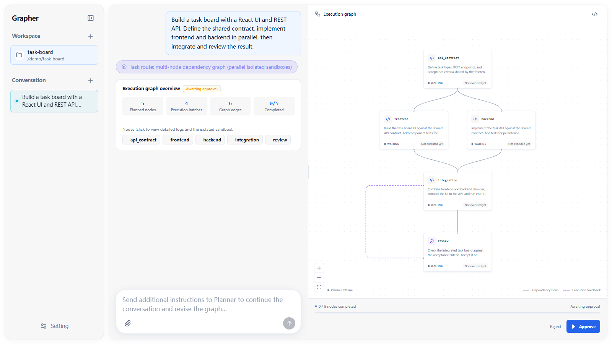

# Grapher

> **Don't orchestrate agents. Compile work.**
>

[](https://github.com/zhexusun10/grapher/actions/workflows/linux-native.yml)
[](https://github.com/zhexusun10/grapher/actions/workflows/windows-native.yml)
[](LICENSE)
[](https://www.rust-lang.org/)

**Local coding-agent architecture that compiles complex work into inspectable execution graphs.**

### Typical multi-agent systems vs Grapher

```text
Typical multi-agent systems

Goal → Supervisor LLM → Agent → Supervisor LLM → Agent → ...
             ↑ scheduling lives inside the conversation loop


Grapher

Goal → Planner → Compiled Graph → Deterministic Runtime
                                      ├── Agent A ──┐
                                      ├── Agent B ──┼──→ Agent D
                                      └── Agent C ──┘
```

**Core differences:**

1. **No supervisor in the execution loop** — The LLM plans the graph, then gets out of the scheduler.
2. **Parallel work inherits code, not conversations** — Each node receives completed parent workspace state.
3. **The graph is executable state** — Dependencies, retries, feedback and publication are explicit runtime transitions.
4. **No predefined agent roles** — All nodes run general-purpose coding agents; specialization comes from task context, not hardcoded roles.

**Not all work needs multiple agents.** Grapher uses intent-based routing in **Auto** mode or lets you choose manually: **Serial** for linear tasks, **Graph** when parallelism helps.

Built on [Pi](https://github.com/earendil-works/pi).

[Quick start](#quick-start) · [How it works](#how-it-works) · [Architecture](docs/architecture/overview.md) · [简体中文](README.zh-CN.md)



*Actual Grapher UI with a demo graph awaiting approval. Fixture data, not a live-model run or benchmark.*

## Why Grapher?

- **Integrated coding-agent environment** — Chat with coding agents, manage provider authentication and model settings, inspect tool calls and logs, and intervene from the same UI.
- **Deterministic orchestration** — Scheduling, dependencies, invalidation, and bounded feedback are explicit Rust state transitions.
- **Workspace inheritance** — Children inherit completed parent state, including ignored project resources; multiple parents are combined. Ordinary dependencies and applied feedback can hand off a completed directory, with one writer at a time and independent parallel branches. Conversations stay with their own nodes.
- **Inspectable execution graph** — Review and approve the graph before execution; see dependencies, parallel branches, and bounded rework in the UI.
- **Local-first** — Run on your machine and publish valid Graph results back to your codebase before declaring completion. Model requests still go to your configured provider.

## When should I use Grapher?

**More agents are not always better.** Grapher works best when a coding task contains independent workstreams, for example:

- Frontend + backend changes
- Implementation + tests
- Multiple independent modules
- Implementation followed by bounded review/rework

For small, linear, or tightly coupled tasks, use **Serial** instead. Use **Graph** when explicit dependencies and independent workstreams justify it; **Auto** lets the Partitioner choose.

| | Serial | Graph |
| --- | --- | --- |
| Best for | Small / linear tasks | Independent workstreams |
| Coding agents | One | One or more task nodes |
| Planning | Direct | Compiled execution graph |
| Approval | Automatic | User approval by default |
| Workspace | Your project | Private Run workspaces with state inheritance and exclusive handoff |
| Scheduling | Sequential | Dependency-aware, bounded parallelism |

See the [execution model](docs/architecture/execution-model.md) for planning side effects and publication semantics. Graph is a route, not a minimum agent count; it can contain a single node.

## Quick start

**Requirements:** Node.js 22.19+, stable Rust, Git, npm, network access, and provider authentication. Windows needs Git for Windows Bash; Linux Graph needs bubblewrap and permitted unprivileged user/mount/PID namespaces. See [Installation](docs/guides/installation.md) for host prerequisites and troubleshooting.

```sh
git clone --recurse-submodules https://github.com/zhexusun10/grapher.git
cd grapher
npm ci --ignore-scripts
npm run pi:setup
npm run dev
```

Open **<http://127.0.0.1:1420>**. The first launch may take time while Cargo compiles.

1. In **Settings**, select a local project, authenticate a provider, and choose a `provider/model`. You can also sign in through `npm run pi`; see [Providers](docs/guides/providers.md).
2. Enter a coding goal. Choose **Serial** for a single Pi agent, **Graph** for a task graph, or **Auto** to let the Partitioner select the route.
3. For Graph, inspect and **approve** the plan. Follow node logs, pause new dispatches, or send instructions.
4. Graph work is complete only after valid results are published to your project. Publication failures preserve state for inspection or retry.

**Use trusted projects; start with a disposable one.** Planner Bash writes directly to the source before approval, even if planning fails or is cancelled; snapshots can stage/commit existing non-ignored changes. Reject is not rollback. Windows workspaces are not filesystem sandboxes. Read the [execution model](docs/architecture/execution-model.md) and [filesystem boundaries](docs/architecture/filesystem-isolation.md) before important work.

For an existing clone, first run `git submodule update --init --recursive`. Pi is pinned; a global Pi installation is not substituted.

For local production mode:

```sh
npm run build
npm start
```

Open <http://127.0.0.1:1421>. Configuration, credentials, data paths, and startup issues are covered in the [installation guide](docs/guides/installation.md).

## Project status

**Grapher is currently alpha software.**

**Working:**
- Serial coding-agent workflow
- Graph planning and approval
- Dependency-aware execution
- Workspace inheritance
- Bounded feedback edges
- Result publication
- Linux sandbox (bubblewrap)

**Still evolving:**
- Packaging and one-command installation
- Cross-platform isolation (Windows sandboxing)
- Routing quality and graph compilation heuristics
- Provider compatibility coverage
- Performance optimization

## How it works

```text
Coding goal
    |
    v
Partitioner
    |-- Simple / linear task --> Serial agent --> User's project
    |
    '-- Independent workstreams
                |
                v
             Planner
                |
                v
       Execution graph --> Compiler --> User approval
                                           |
                                           v
                              Deterministic Rust runtime
                                  |               |
                               Agent A         Agent B
                                  \               /
                                  Workspace inheritance
                                           |
                                           v
                                        Agent C
                                           |
                                           v
                                  Publish to project
```

Models decide how to split the work and perform each task. The compiler validates the graph. After compilation, the planner can stop: scheduling no longer depends on a coordinator's next message. Ordinary dependencies form a DAG: a child runs after its parents complete and inherits their workspace state. Applied feedback sends bounded rework instructions and hands the sender's completed workspace to a fixed target, which continues its own conversation. Ordinary dependencies and feedback inherit project file state, not other nodes' conversations; feedback still has separate budget, generation, and invalidation rules.

## Architecture

The Rust backend and SQLite event log own runtime state; the React UI displays projections. Graph executions use private Run repositories with one writer per directory; completed directories can pass between nodes rather than being permanently assigned to one node. The backend prepares inherited state and records Git snapshots plus versioned ignored files; agents do not exchange commits. Delivery requires successful publication—not merely finished model calls.

Read [Architecture](docs/architecture/overview.md) for motivation and invariants, or [Execution model](docs/architecture/execution-model.md) for planning, sessions, workspace inheritance, Git snapshots, and publication semantics. Low-level runtime, isolation, and Pi contracts are linked from those pages rather than duplicated here.

## Development

```sh
npm run check
npm run build
npm run check:docs
npm run test:frontend
npm test                      # Rust fixtures; no paid model
```

See [Contributing](CONTRIBUTING.md) and the [testing guide](docs/development/testing.md) for integration/platform checks and log acceptance. Report vulnerabilities through the [security policy](SECURITY.md). Model-free tests do not establish provider quality or every sandbox boundary.

## Documentation

Start with the [task-oriented documentation index](docs/index.md). Coding agents
should use [AGENTS.md](AGENTS.md) for navigation and repository constraints.

- [Architecture](docs/architecture/overview.md)
- [Why compile agent work?](docs/architecture/why-compile.md)
- [Execution model](docs/architecture/execution-model.md)
- [Installation & providers](docs/guides/installation.md)
- [Development guide](docs/development/contributing.md)
- [Benchmarks](docs/benchmarks/harbor.md)

## License

Original Grapher code is licensed under the [MIT License](LICENSE), copyright © 2026 Sun Zhe-xu. The upstream `pi/` submodule has its own [MIT license and copyright notice](pi/LICENSE). Third-party dependencies retain their respective licenses.
