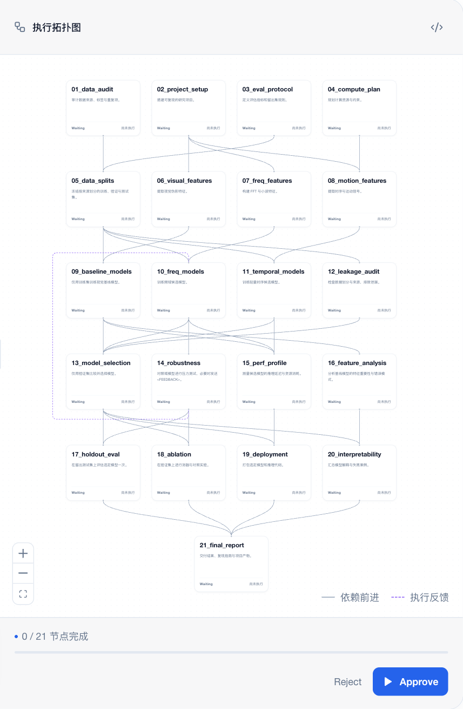

<p align="center">
  
</p>

<h1 align="center">Grapher</h1>

<p align="center">
  <strong>不编排智能体，编译工作。</strong><br>
  告别“转述失真”。
</p>

<p align="center">
  将复杂工作编译为可检查执行图的本地 Coding Agent 工作台。<br>
  基于 <a href="https://github.com/earendil-works/pi">Pi</a> 构建 · 目前处于 alpha 阶段
</p>

<p align="center">
  <a href="#快速开始">快速开始</a> ·
  <a href="#工作方式">工作方式</a> ·
  <a href="docs/user-guide.md">使用指南</a> ·
  <a href="README.md">English</a>
</p>

<p align="center">
  <a href="https://github.com/zhexusun10/grapher/actions/workflows/planner-source.yml"></a>
  <a href="LICENSE"></a>
  <a href="https://www.rust-lang.org/"></a>
</p>

<p align="center">
  
  <br><sub>从复杂目标到可检查的执行图。画面为审批前的合成演示计划。</sub>
</p>

## 为什么选择 Grapher？

- **一个工作台** — 在同一界面与 Agent 对话、配置服务商和模型、查看工具调用与日志，并随时干预。
- **确定性编排** — 模型负责规划；Rust Runtime 负责调度、依赖、结果失效、重试和有界反馈，执行循环中无需主管 Agent。
- **传递代码，而非闲聊** — 节点之间不交换对话；子节点继承父节点的 Git 历史与项目文件状态，包括匹配 `.gitignore` 的文件。线性任务可以交接工作区，fan-out 分支则使用独立 Git worktree。
- **可检查的执行图** — 执行前查看并批准任务图；执行中可以看到依赖、并行分支和有界返工。
- **通用 Agent** — 节点通过任务上下文获得专业化，而非依赖预定义或硬编码角色。
- **本地优先** — 在你的机器上运行，并在宣告完成前把有效的 Graph 结果发布回代码库。模型请求仍会发送给你配置的服务商。

## 一个目标，多条工作流

这个视频取证示例涵盖数据审计、视觉／频域／时序模型并行研究、数据泄漏检查、鲁棒性测试、一次留出集评估和可复现交付。计划包含 **21 个节点、6 个执行批次**；反馈边将鲁棒性测试结果送回频域模型分支。

<p align="center">
  
  <br><sub>这是审批前的合成演示计划，不代表已完成的运行、基准成绩或图规模上限。</sub>
</p>

<details>
<summary><strong>查看旧版界面中的 16 节点实际完成记录</strong></summary>
<p align="center">
  
  <br><sub>多阶段机器学习任务的历史截图，不代表基准测试成绩。</sub>
</p>
</details>

## 什么时候应该使用 Grapher？

<p align="center">
  
  <br><sub>从一个目标出发，选择适合当前任务的执行路线。截图使用演示数据。</sub>
</p>

**Agent 并不是越多越好。** Grapher 最适合包含独立工作流的编程任务，例如：

- 前端 + 后端修改
- 实现 + 测试
- 包含独立特征工程和评估工作流的研究任务
- 实现后进行有界审查 / 返工

小型、线性或高度耦合的任务应使用 **Serial**。只有当显式依赖和独立工作流值得拆图时才使用 **Graph**；**Auto** 让 Partitioner 选择路线。

| | Serial | Graph |
| --- | --- | --- |
| 适合任务 | 小型 / 线性任务 | 独立工作流 |
| 编程 Agent | 一个 | 一个或多个任务节点 |
| 规划 | 直接执行 | 编译执行图 |
| 审批 | 自动 | 默认由用户批准 |
| 工作区 | 用户项目 | 支持状态继承与独占交接的 Run 私有工作区 |
| 调度 | 顺序执行 | 依赖感知、有界并行 |

规划副作用、操作控制与恢复方式见[使用指南](docs/user-guide.md)。Graph 是执行路线，不是 Agent 数量下限；图也可以只有一个节点。

## 快速开始

**依赖：** Node.js 22.19+、稳定版 Rust、Git、npm、网络和服务商认证。Windows 需要 Git for Windows Bash；macOS 需要 Xcode Command Line Tools（用于 Rust 链接），Graph 使用系统内置 Seatbelt 沙箱；Linux Graph 需要 bubblewrap，并允许非特权 user/mount/PID namespace。

**不想安装编译工具？** 直接下载可运行的[发布包](https://github.com/zhexusun10/grapher/releases/latest)：校验 `.sha256` 后解压，运行 `start.bat`（Windows）或 `./start.sh`（macOS/Linux）。发布包在运行时仍需要 Node.js 22.19+ 与 Git；无需 Rust 和 npm。

```sh
git clone --recurse-submodules https://github.com/zhexusun10/grapher.git
cd grapher
npm run dev
```

`npm run dev` 会自动检查环境工具、初始化子模块、安装锁定依赖并编译后端。也可手动执行 `npm ci --ignore-scripts` 与 `npm run pi:setup` 分步准备。

打开 **<http://127.0.0.1:1420>**。首次启动可能需要等待 Cargo 编译。macOS 上后端运行期间会保持显示器和系统唤醒，避免长时间任务因空闲睡眠或屏幕保护锁定而中断；设置 `GRAPHER_KEEP_AWAKE=0` 可关闭。

1. 在**设置**中选择本机项目，完成服务商认证并选择 `provider/model`。也可通过 `npm run pi` 登录。
2. 输入编程目标。选择 **Serial** 使用单个 Pi Agent，选择 **Graph** 规划任务图，或让 **Auto** 由 Partitioner 判断路线。
3. Graph 模式下查看并**批准**计划。执行中可查看节点日志、暂停正在运行的节点并稍后继续原会话，或追加指令。
4. Graph 的有效结果成功发布回项目后才算完成；发布失败会保留状态供检查或重试。

**只在可信项目上使用，首次体验建议用可丢弃的项目。** Planner 的 Bash 写入会在审批前直接修改源项目，规划失败或取消也不会回滚；Git 快照会强制收集项目文件，Runtime/环境内部目录除外。拒绝计划不等于回滚。Windows 工作区不是文件系统沙箱。在重要代码上运行前，请阅读[审批前须知](docs/user-guide.md#before-you-approve)和[文件系统边界](docs/architecture/filesystem-isolation.md)。

已有克隆仓库请先运行 `git submodule update --init --recursive`。Pi 是锁定版本，不会使用全局 Pi 替代。

本机生产模式：

```sh
npm run build
npm start
```

打开 <http://127.0.0.1:1421>。

## 项目状态

**Grapher 目前是 alpha 阶段软件。**

**已实现功能：**
- Serial 单 Agent 编程工作流
- Graph 任务图规划与审批
- 依赖感知的执行调度
- 工作区状态继承
- 有界反馈边
- 结果发布机制
- 任务后 Planner 复盘与闭环自主迭代（Loop Engineering）
- Linux 沙箱（bubblewrap）
- Windows/macOS/Linux 发布包与一键开发启动

**仍在完善：**
- 跨平台隔离（Windows 沙箱）
- 路由质量与图编译启发式
- 服务商兼容性覆盖
- 性能优化

## 工作方式

```text
编程目标
    |
    v
Partitioner
    |-- 简单 / 线性任务 --> Serial Agent --> 用户项目
    |
    '-- 独立工作流
                |
                v
             Planner
                |
                v
       执行图 --> 编译器 --> 用户批准
                                |
                                v
                    确定性 Rust 运行时
                      |               |
                   Agent A         Agent B
                      \               /
                      工作区继承
                                |
                                v
                             Agent C
                                |
                                v
                          发布到项目
```

模型负责拆分工作并执行具体任务，编译器负责验证图。编译完成后，Planner 可以退出：调度不再依赖协调器的下一条消息。普通依赖构成 DAG：子节点在父节点完成后运行，并继承父节点的 Git 历史以及完整项目文件状态，包括匹配 `.gitignore` 的路径。已应用的反馈会向固定目标发送有界返工指令，并把发送方已完成的工作区交给目标；目标继续自己的对话。所有项目输出都是 Git 提交；节点之间绝不交换对话上下文，确保技术意图与代码真实状态永远不会在多 Agent 传话中失真（Never lost in translation）。

开启**任务后 Planner 复盘**（Post-task Planner review）后，当图任务全部执行完毕并将代码发布写回源项目后，系统会自动唤起 Planner 审查最新状态并自主决定下一步行动——包括审核工作区、制定新计划/派发新节点、向用户汇报结果或完成收尾工作等，不做人工限制。整个流程始终严格遵循节点间无 message 传递的核心设计（通过 Git 工作区状态继承而非会话传递）。配合**自动批准（Auto Approve）**，可形成鲁棒的 Loop Engineering 自主迭代闭环。

## 架构

**模型负责编码，Runtime 负责流程。** Grapher 将依赖、有界返工与交付显式化，而不是把调度交给另一段对话。你可以检查计划、在执行中干预，并确认结果确实写回项目。

日常操作请阅读[使用指南](docs/user-guide.md)。如果要开发或修改 Grapher，请从[开发者架构文档](docs/architecture/overview.md)了解组件边界与各专题的唯一契约。

## 开发

```sh
npm run check
npm run build
npm run test:frontend
npm run test:backend          # Rust 固定样例；无需付费模型
```

集成、平台验证和日志验收见[贡献指南](CONTRIBUTING.md)与[测试指南](docs/development/testing.md)。安全漏洞请按[安全政策](SECURITY.md)报告。无模型测试不能证明服务商效果或全部沙箱边界。

## 文档导航

**使用 Grapher：** [使用指南](docs/user-guide.md) · [安全政策](SECURITY.md)。

**开发 Grapher：** [架构契约](docs/architecture/overview.md) · [贡献指南](CONTRIBUTING.md) · [Benchmark / Evaluation](docs/benchmarks/harbor.md)。

[文档索引](docs/index.md)区分用户指南与开发者任务路由。Coding Agent 应使用 [AGENTS.md](AGENTS.md) 了解仓库约束。

## 许可证

Grapher 原创代码采用 [MIT 许可证](LICENSE)，版权所有 © 2026 Sun Zhe-xu。上游 `pi/` 子模块遵循其自身的 [MIT 许可证和版权声明](pi/LICENSE)；第三方依赖仍遵循各自的许可证。
