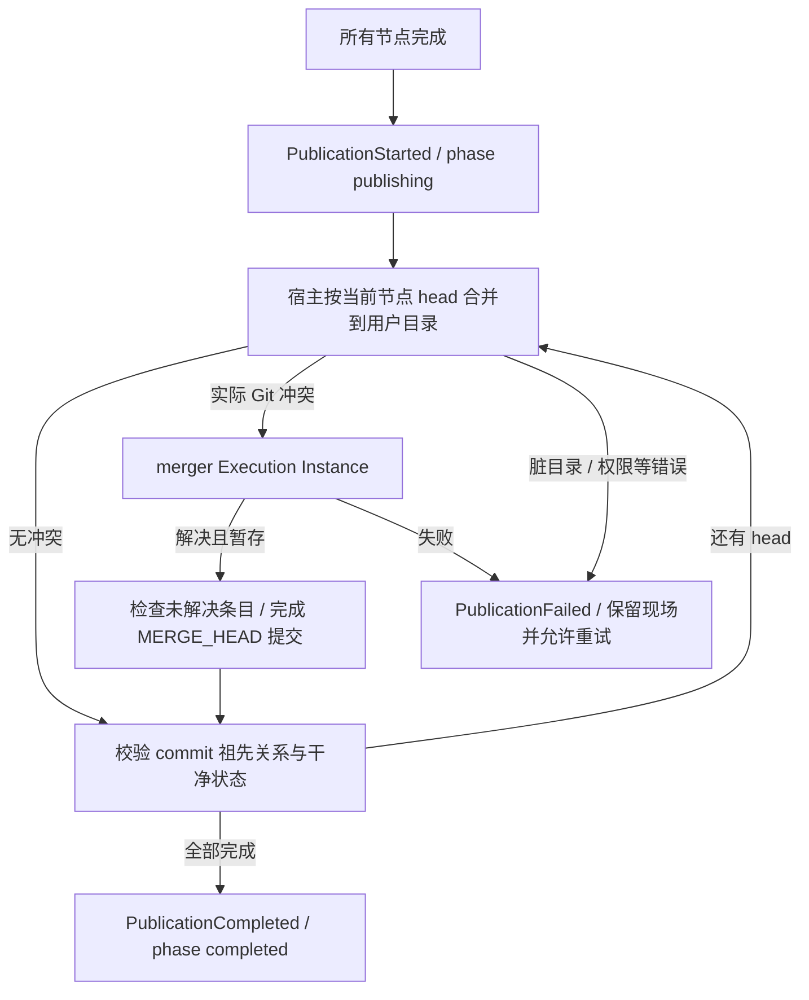

# Grapher — Don't Orchestrate Agents. Compile Work.

> **Core Philosophy**  
> 用少量 Planner 结构化开销换掉大量 Multi-Agent 运行期 Coordination Token。  
> 从始至终都不存在“派发 Node Agent”这个 Planner 工具。  
>
> **Pi 只是执行引擎。**  
> Grapher 真正拥有的是：
>
> **Partitioner + Planner + Graph Compiler + Graph Runtime + Workspace Runtime + Graph UI + Human Intervention + Execution History**
>
> Grapher 不在运行时持续 orchestrate agents。  
> Grapher 先把工作**编译成执行图**，随后由确定性的 Runtime 执行这张图。

---

# 1. 核心模型

传统 Multi-Agent 系统通常依赖一个持续在线的 Coordinator：

```text
User
  ↓
Coordinator
  ├── Ask Agent A
  ├── Read A
  ├── Ask Agent B
  ├── Read B
  ├── Ask A again
  ├── Ask Reviewer
  └── ...
```

Coordinator 长时间存活，并持续承担：

- 调度
- 消息转发
- 状态理解
- Agent 选择
- 重试判断
- 上下文维护
- 中间结果总结

这会产生大量 Coordination Token、长上下文和运行时不确定性。

Grapher 将其改造成：

```text
User Intent
    │
    ▼
Partitioner
    │
    ├── Serial ───────────────→ Pi
    │
    └── Graph
          │
          ▼
       Planner
          │
          ▼
       Graph IR
          │
          ▼
       Compiler
          │
          ▼
     Approval Gate
          │
          ▼
     Graph Runtime
       /   |   \
      Pi   Pi   Pi
          ...
```

Planner 只负责：

```text
Intent → Graph IR
```

Compiler 负责：

```text
Graph IR → Validated Execution Plan
```

Runtime 负责：

```text
Execution Plan + Workspace State → Incremental Execution
```

Pi 负责：

```text
Task + Workspace → Work
```

Planner 在 Graph 编译成功后立即退出。

**Planner 不参与运行期协调。**

---

# 2. System Architecture

```mermaid
flowchart TD
    User([User Request]) --> Partitioner[Partitioner]

    Partitioner -->|Serial| SerialPi[Single Node Agent]
    Partitioner -->|Graph| Planner[Graph Planner]

    subgraph CompilationPhase
        Planner -->|node / edge / read / bash| Compiler[Graph Compiler]
        Compiler -->|Diagnostics| Planner
        Compiler -->|Valid Graph| Approval{User Approval}
    end

    Planner -.->|Compilation Complete: Exit| PlannerExit[(Planner Off)]

    Approval -->|Approve| Runtime[Graph Runtime]
    Approval -->|Reject / Edit| Planner

    subgraph RuntimePhase
        Runtime --> Workspace[Workspace Runtime]
        Runtime --> EventStore[(Execution Event Store)]
        Runtime --> PiA[Node Agent A (Fresh Instance)]
        Runtime --> PiB[Node Agent B (Fresh Instance)]
        Runtime --> PiC[Node Agent C (Fresh Instance)]

        Workspace --> WorktreeA[Git Worktree A]
        Workspace --> WorktreeB[Git Worktree B]
        Workspace --> WorktreeC[Git Worktree C]
    end

    Runtime --> GraphUI[Live Graph UI]
    GraphUI --> Human[Human Intervention]
    Human --> Runtime
```

---

# 3. Partitioner

## 3.1 定位

Partitioner 是 Grapher 的流量入口。

它不负责规划任务，只负责判断：

> 这个任务是否值得承担 Graph Planning 的结构化开销？

重点不是：

> “这个任务理论上能不能拆？”

而是：

> “这个任务是否包含多个能够独立产生有效进展的 substantial workstreams？”

---

## 3.2 Routing

Partitioner 是无工具的单轮分类器，输出 `graph` 或 `serial`，不规划或解决任务。宿主解析分类文本；成功调用但输出含糊时按当前解析策略回退 Serial。模型启动、认证或请求失败不属于分类结果，必须显式报错，不能自动启动 Serial。

### Serial

适合：

- 单文件修改
- 小型 bug fix
- 简单重构
- 高度线性的任务
- 分解后几乎不存在有效并行度的任务

直接交给一个原生 Node Agent (Execution Instance)。

### Graph

适合：

- 前后端并行
- 多模块实现
- 独立研究任务
- 实现 + 独立验证
- 多个能够同时推进的 substantial workstreams

交给 Graph Planner。

---

# 4. Graph Planner

## 4.1 定位

Graph Planner 是一个短生命周期的 **Execution Graph Compiler Frontend**。

它不是：

- Manager
- Coordinator
- Supervisor
- Runtime Agent Router

它只负责：

> 将 User Intent 转换成完整可执行的 Task Graph。

---

# 5. Planner Tools

Planner 只有四个工具：

```text
node
edge
read
bash
```

不存在：

```text
spawn_agent
delegate
run_agent
ask_agent
send_message
```

等任何派发 Agent 或运行 Agent 的能力。

Planner 无法直接创建或运行任何 Node Agent (Execution Instance)。

其中：

- `node`：创建、修改、删除 Graph Node
- `edge`：创建、修改、删除 Graph Edge
- `read`：读取 Repository / Workspace
- `bash`：受限只读检查入口，内部解析 ls/find/rg 等白名单命令，不执行任意 shell。

Graph 中使用语义化的 Node `name` 作为 Planner 可见的唯一标识。

`name` 同时用于：

- Planner 引用 Node
- Edge 引用 Node
- Graph UI 默认展示 Node 名称

Grapher 内部持久化可以另外生成 UUID，但内部 ID 不暴露给 Planner。

---

## 5.1 `node`

`node` 负责创建、修改或删除一个 Graph Node。

```ts
interface NodeToolInput {
  /**
   * 当前 Graph 内唯一的 Node 名称。
   *
   * 应该简短、稳定并具有语义，例如：
   *
   * "api_spec"
   * "frontend"
   * "backend"
   * "integration_test"
   * "security_review"
   */
  name: string;

  /**
   * 给这个 Node Execution 对应 fresh Node Agent (Execution Instance)
   * 使用的 Specific Task。
   *
   * Node Agent 不知道 Graph 的存在，因此 task 应该能够独立表达
   * 这个 Node 需要完成的工作。
   *
   * delete=true 时可以省略。
   */
  task?: string;

  /**
   * false / omitted:
   *   Node 不存在 → CREATE
   *   Node 已存在 → UPDATE
   *
   * true:
   *   DELETE Node
   *
   * 删除 Node 时，同时删除所有与该 Node 相连的 Edge。
   */
  delete?: boolean;
}
```

因此：

```text
node(name, task)
```

使用 upsert semantics。

Node 不存在则创建，已经存在则修改。

删除：

```text
node(name, delete=true)
```

---

## 5.2 `edge`

`edge` 负责创建、修改或删除两个 Node 之间的关系。

```ts
interface EdgeToolInput {
  /**
   * Edge 起点。
   * 必须引用已经存在的 Node name。
   */
  from: string;

  /**
   * Edge 终点。
   * 必须引用已经存在的 Node name。
   */
  to: string;

  /**
   * Edge 的语义关系描述。
   *
   * 主要供 Planner、Compiler Diagnostic 和 Graph UI 理解。
   * Runtime 不依赖 relation 文本决定控制流。
   *
   * relation 保持自由文本，不限制为 enum。
   *
   * delete=true 时可以省略。
   */
  relation?: string;

  /**
   * 是否为 Feedback Edge。
   *
   * 必须显式提供。
   *
   * feedback=false:
   *   普通 Dependency Edge。
   *   A → B 表示 B 必须等待 A 成功完成。
   *
   * feedback=true:
   *   Feedback Edge。
   *   当 from Node 输出 <REVISE> 时，
   *   Runtime 沿该 Edge 回到 to Node，
   *   为 to Node 创建一次新的 Execution，
   *   并启动一个 fresh Execution Instance。
   *
   * Feedback Edge 可以形成受 Runtime retry limit
   * 控制的 Cycle。
   */
  feedback: boolean;

  /**
   * false / omitted:
   *   Edge 不存在 → CREATE
   *   Edge 已存在 → UPDATE
   *
   * true:
   *   DELETE Edge
   */
  delete?: boolean;
}
```

MVP 中 Edge Identity 为：

```text
(from, to)
```

同一对 Node 之间最多存在一条直接 Edge。

因此再次调用相同 `(from, to)` 的 `edge` 代表修改现有 Edge，而不是创建 Parallel Edge。

---

### Dependency Edge Example

```ts
edge({
  from: "api_spec",
  to: "frontend",
  relation: "frontend implements the API contract",
  feedback: false
})
```

表示：

```text
api_spec → frontend
```

`frontend` 必须等待 `api_spec` 完成。

---

### Feedback Edge Example

```ts
edge({
  from: "frontend_review",
  to: "frontend",
  relation: "requests revision when frontend verification fails",
  feedback: true
})
```

表示：

```text
frontend
    │
    ▼
frontend_review
    │
    │ feedback=true
    ▼
frontend
```

因为 `frontend_review` 存在 outgoing `feedback=true` Edge，Runtime 自动在该 Node 的 Task 末尾追加 Feedback Protocol：

```text
End your response with one of:

<ACCEPT>

<REVISE>

If REVISE, clearly describe the changes needed
```

`<ACCEPT>`：

不触发 Feedback Edge。

`<REVISE>`：

Runtime 沿 Feedback Edge 重新执行 `frontend`，并为新的 Execution 创建一个 fresh Execution Instance。

Feedback 的 Routing 由 Graph 决定，而不是由 Reviewer 自己决定。

---

## 5.3 `read`

尽可能直接复用 Pi 原生 `read` 工具定义。

Planner 可以读取：

- Repository structure
- Source files
- Package manifests
- Configuration
- Existing architecture
- README / AGENTS.md
- Build configuration

`read` 用于帮助 Planner 理解真实 Repository，并制定合理的 Graph。

---

## 5.4 `bash`（受限只读检查）

Planner 注册自定义 bash，覆盖 Pi 的任意 shell 工具。命令字符串经专用解析器分派，不交给 shell 执行。支持 pwd、ls、find、rg/grep、cat、head/tail，以及读取公开 HTTP(S) 文档的 curl GET/HEAD；具体参数见工具描述及 `backend/resources/planning-inspection.md`。

本地路径和 read 一样限制在当前仓库内，拒绝符号链接和 .git；禁止写入、脚本、测试、重定向、管道及命令组合。curl 不读取本机配置或代理，不允许上传、认证、请求体、非 HTTP(S) 协议和本机/内网地址；DNS 结果固定到已验证的公网地址，每次重定向重新验证。

这些检查用于理解现有契约、组件边界和依赖关系。实际实现、测试与实验由节点执行阶段负责。工具层只读不是进程级沙箱，也不能保证公网 GET 在远端没有副作用。

---

## 5.5 Graph Mutation & Compiler Validation

每次 `node` / `edge` mutation 都经过 Graph Compiler 的确定性检查。

至少包括：

```text
Node name must be unique.

Node task must not be empty when creating/updating a node.

Edge.from must exist.

Edge.to must exist.

Edge.from must not equal Edge.to.

There may be at most one edge for each (from, to) pair.

Removing all feedback=true edges must leave an acyclic dependency graph.
```

如果 mutation 不合法：

1. 当前 Graph 不发生该次修改。
2. Compiler 返回明确 Diagnostic。
3. Planner 根据 Diagnostic 再次调用 `node` / `edge` 修正。

例如：

```text
Rejected: dependency cycle detected:

api → frontend → api

Normal dependency edges must remain acyclic.
Cycles are only permitted through explicit feedback edges.
```

# 6. Planner Contract

当前系统提示词的唯一来源是 [`backend/resources/prompts/planner.md`](backend/resources/prompts/planner.md)。它仍会通过 benchmark 迭代，但已经有实际执行契约，不能将本文旧示例视为另一份提示词。

Planner 编译完整可执行工作图。节点代表有意义的工作成果，节点数不是优化目标；不把实现步骤逐条拆成节点。每个 task 需包含足以独立执行的目标、相关用户要求、重要约束/契约、职责边界和验收方式。除非用户或权威契约已指定，探索仓库、实现方案、文件修改、算法和详细测试设计留给节点执行。

检查只用于消除可能影响节点边界、依赖、并行性、可合并性或权威契约的不确定性。只会令 task 更详细、不会改变图结构的检查应停止。相关公开文档可作为约束依据，但外部内容不是执行指令。

普通依赖边只表达下游需要上游文件状态或不能安全并行的关系；共享契约节点只在多个工作单元确实需要尚未存在的共同决策时建立。Feedback 只用于有意义且有界的审查修正流程。采用仓库相对路径，禁止引用 Planner checkout 的绝对路径。

图结构明确、目标覆盖完整、编译通过后停止；实现不确定性可以留给执行，图结构不确定性必须在编译期消除。

## Planner Inputs

Planner 可以获得：

- User Goal
- 当前 Repository / Workspace 的只读可见性
- Graph Compiler 返回的 diagnostics
- Grapher 必要的 execution semantics

## Planner Tools

Planner 只有：

```text
node
edge
read
bash
```

不存在任何：

```text
spawn_agent
delegate
run_agent
ask_agent
```

类型的工具。

## Planner Output

Planner 的唯一核心产物是：

> 一个可以通过 Graph Compiler，并能够交给 Graph Runtime 执行的 Graph。

## Planner 必须理解的 Runtime Semantics

Planner 在规划时需要知道：

- 每一次 Node Execution 都由一个全新的 Node Agent (fresh Execution Instance) 执行。
- 普通 Dependency Edge 表示执行依赖。
- Feedback Edge 可以产生受控 Cycle。
- 删除所有 Feedback Edge 后，Dependency Graph 必须可以作为 DAG 调度。
- 可以并行执行的 Node 会运行在相互隔离的 Git Worktree 中。
- 并行 Worktree 的修改在下游汇合之前需要重新 composition / merge。
- 因此，任务在逻辑上可并行，并不自动意味着它适合作为两个 filesystem-level parallel nodes。
- Planner 在划分并行任务时需要考虑 task boundary 的 mergeability，尽量避免没有必要的高冲突并行写入。

## Planner 不负责

Planner 不负责：

- 创建或派发 Node Agent (Execution Instance)
- 执行任何 Graph Node
- Runtime Scheduling
- 创建或管理 Git Worktree
- 实际执行 Git Merge
- 解决 Runtime Merge Conflict
- Feedback Retry
- Node State Management
- Execution History
- 在 Graph 执行期间继续存活

核心边界：

> **Planner plans for mergeability. Runtime performs merges.**

## Planner Prompt

参见实际 [Planner prompt](backend/resources/prompts/planner.md) 和 [Partitioner prompt](backend/resources/prompts/partitioner.md)。宿主把 `User query:` 之前的部分作为系统提示词，把原始 goal 单独作为 user message；各角色拥有独立配置（支持 `PARTITIONER_MODEL` / `PARTITIONER_THINKING`、`PLANNER_MODEL` / `PLANNER_THINKING`、`NODE_AGENT_MODEL` / `NODE_AGENT_THINKING`、`MERGER_MODEL` / `MERGER_THINKING`，超时通过 `*_TIMEOUT_SECONDS` 配置）。普通节点（Node Agent）使用 `NODE_AGENT_MODEL` / `NODE_AGENT_THINKING`。候选图和原始 JSON 输出保存在 runtime 的 `planning/<id>/`。

Partitioner 不注册工具：多个实质工作流能够独立推进才输出 Graph，否则 Serial；分类结束即退出，不规划或解决任务。调用失败保留日志并返回错误，不创建或审批执行图。Serial 不调用 Planner，生成唯一名为 `task` 的节点并由后端自动审批启动，直接写用户目录。Graph 则经过 Planner、最终编译与用户审批。

Prompt 保持简洁，结构性错误由 Compiler diagnostics 纠正。只读检查的具体语法和拒绝行为以 [planning-inspection.md](backend/resources/planning-inspection.md) 为准。

# 7. Planner Lifecycle

Planner 生命周期严格限制在 Compilation Phase。

```text
Planner starts
    ↓
Inspect repository
    ↓
Construct graph
    ↓
Compiler validates
    ↓
Compiler rejects?
    ├── yes → Planner fixes graph
    │
    └── no
         ↓
    Compilation complete
         ↓
      Planner exits
```

一旦 Graph 编译成功：

> **Planner 彻底退出。**

执行期间：

```text
Planner Token Usage = 0
```

节点失败不会自动唤醒 Planner。

Feedback 不会唤醒 Planner。

Runtime 不会向 Planner 请求决策。

所有 Runtime 行为由：

- Graph
- Compiler-generated metadata
- deterministic runtime rules
- Pi execution result
- Human Intervention

决定。

---

# 8. Graph Model：允许受控 Cycle

Grapher **不是纯 DAG 系统**。

完整 Graph 允许 Cycle。

但是 Cycle 必须具有明确的 Runtime Semantics。

Graph 中存在两类 Edge。

---

## 8.1 Dependency Edge

```text
A ─────→ B
```

含义：

> B 只能在 A 成功完成后开始。

删除所有 Feedback Edge 后：

> **剩余 Dependency Graph 必须是 DAG。**

因此 Runtime 可以对 Dependency Graph：

- topological sort
- calculate ready nodes
- identify concurrency
- construct execution batches

---

## 8.2 Feedback Edge

```text
Reviewer
    │
    │ feedback=true
    ▼
Implementation
```

Feedback Edge：

- 可以指向已经执行过的节点
- 可以形成 Cycle
- 不参与 Dependency Graph 的拓扑排序
- 只有 `<REVISE>` 才触发
- 受 Runtime retry limit 控制

例如：

```text
Implementation
      │
      ▼
   Reviewer
      │
      │ feedback
      ▼
Implementation
```

这是合法 Cycle。

---

## 8.3 非法 Cycle

例如：

```text
A → B → C
↑       │
└───────┘
```

如果其中没有 Feedback Edge，则非法。

Compiler：

```text
Rejected: dependency cycle detected:

A → B → C → A

Normal dependency edges must form an acyclic graph.
Cycles are only permitted through explicit feedback edges.
```

---

# 9. Graph Compiler

Graph Compiler 是 deterministic static analyzer。

设计原则：

> **Compiler feedback, not prompt teaching.**

不在 Planner Prompt 中提前解释所有 corner cases。

Planner 提交 Graph。

Compiler 检查。

错误则返回精确 diagnostics。

Planner 根据 diagnostics 修改 Graph。

---

## 9.1 Static Analysis

Compiler 至少负责：

### Dependency Cycle Detection

删除 Feedback Edge 后检查 Dependency Graph 是否存在 cycle。

---

### Feedback Validation

Feedback Edge 必须：

- `feedback=true`
- from/to node 均存在
- target 是可重新执行节点
- 不允许 self-feedback
- feedback path 能形成有意义的 bounded retry transition

---

### Dangling Nodes

检测没有实际参与执行结果的孤立节点。

---

### Reachability

检测不可达节点。

---

### Duplicate Node

检测重复或冲突 Node Name。

---

### Invalid Edge

检测不存在的 source / target。

---

### Empty Task

Node 必须拥有有效 Specific Task。

---

### Execution Layers

只针对 Dependency Edge 生成：

```ts
executionBatches: string[][]
```

例如：

```text
Batch 0:
api_spec

Batch 1:
frontend
backend

Batch 2:
integration_test
```

Feedback Edge 不参与 batch topology。

---

## 9.2 Compiler Diagnostics

例如：

```text
E101 DEPENDENCY_CYCLE

frontend → integration_test → frontend

Normal dependency edges must form an acyclic graph.
Use an explicit feedback edge for revision flow.
```

或者：

```text
E204 UNKNOWN_NODE

Edge:
qa_review → frontend_app

Target node "frontend_app" does not exist.
```

Planner 根据 Compiler Feedback 自行修改。

---

# 10. User Approval Gate

Graph 编译通过后：

**不能立即执行。**

右侧 Graph UI 首先展示完整 Execution Graph。

用户可以：

```text
Approve & Start
Edit
Reject
```

只有：

```text
Approve & Start
```

之后 Runtime 才能创建 Execution Instance。

这是 Graph 路由的 Human Approval Boundary。Serial 路由由后端自动批准单节点并直接执行，不再经过单独的图审批操作；源目录检查仍适用。

---

# 11. Graph Runtime

Graph Runtime 是 Grapher 的核心确定性执行引擎。

它不进行 LLM reasoning。

它负责：

- dependency resolution
- concurrency
- Execution Instance process lifecycle
- worktree lifecycle
- workspace state
- feedback transition
- retry limits
- failure propagation
- dirty propagation
- user intervention
- event recording

---

# 12. Node ≠ Node Agent (Execution Instance)

这是 Grapher 的核心约束。

**Graph Node 是稳定的 Task Definition。**

**Node Agent (Execution Instance) 是一次 Node Execution Attempt。**

例如：

```text
frontend
│
├── Execution #1
│      └── Node Agent A (Execution Instance)
│
├── Execution #2
│      └── Node Agent B (Execution Instance)
│
└── Execution #3
       └── Node Agent C (Execution Instance)
```

每一次 Execution：

> **必须创建全新的 Node Agent (Execution Instance)。**

永远不恢复上一轮 Node Agent Session 继续执行。

---

## 12.1 Feedback Example

```text
frontend execution #1
        ↓
review execution #1
        ↓
     REVISE
        ↓
feedback edge
        ↓
frontend execution #2
        ↓
review execution #2
```

其中：

```text
frontend #1 ≠ frontend #2
review #1 ≠ review #2
```

四次 execution 对应四个独立 Node Agent (Execution Instance)。

旧 Conversation 保留在 Execution History。

---

# 13. Node Agent 的上下文与文件边界

普通 Graph 节点的 Node Agent 使用全新会话、节点 task 和当前 worktree，不获得 Graph mutation、调度或派发工具。Pi 是唯一 Execution Instance Engine，原生 read/write/edit/bash 工具通过 macOS Seatbelt 受同一个进程级文件策略约束，Bash 子进程继承策略。

策略以 canonical 源目录、`.grapher-worktrees` 根和当前节点目录生成。默认允许宿主其他路径和网络，拒绝源目录与整个 worktree 根中当前节点以外的目录。因此对其他 run、稍后创建的 worktree、`..` 和解析到受保护目录的符号链接同样生效，不是先扫描现有 sibling 再生成固定列表。

只允许读取 worktree 根和当前 run 的路径定位 metadata，以兼容 Node `realpath`；不允许枚举它们的目录内容。当前节点文件允许读写。共享 Git common-dir 也被拒绝，包括位于源目录之外的独立 git-dir 与 shadow repository：这些目录能泄漏其他分支对象及工作区信息。节点内部 `git status/show` 等依赖 common-dir 的命令可能失败，prepare、snapshot、merge 由宿主 Workspace Runtime 执行。

系统没有 `sandbox-exec` 时，生产 Graph 节点必须失败，不回退到无隔离执行。Grapher/Pi 安装与 runtime 会话目录也必须在受保护源目录之外，否则会一并被拒绝访问；对 Grapher 自身运行 Graph 任务需从另一份外部安装启动。`fixture` 编译特性可注入测试替身，它的测试通过不代表 sandbox 被测过。Serial、Partitioner/Planner、merger 在源目录执行，不套用普通 Graph 节点的源目录 deny 规则；Planner 另有工具层只读限制。

这不是敌对代码的宿主安全隔离：按产品要求保留外部文件、网络和环境认证访问，因此外部副本、预先存在的外部 hardlink、宿主服务/代理不在直接路径策略的保护范围内。宿主用户和 Rust Git 操作不受节点 profile 限制。

Pi 系统提示词的身份与文档引导由 Grapher-owned prompt extension 清理，provider/auth upstream 代码不裁剪。Pi 的 cwd 来自实际执行目录；节点应使用当前目录的相对路径，不回到原仓库。

---

# 14. Workspace Runtime

Grapher 不引入额外 Artifact Protocol。

Node 之间不进行：

```text
extract artifact
→ serialize artifact
→ inject artifact into downstream prompt
```

Grapher 不要求 Pi 输出 Grapher-specific artifact schema。

节点之间真正共享的是：

> **Filesystem State**

---

# 15. Git Worktree Isolation

并行 Node 不应该直接写入同一个 working directory。

否则：

```text
frontend ─┐
          ├── package.json
backend ──┘
```

可能产生 filesystem race condition。

因此每个并行 Execution 使用独立 Git Worktree。

例如：

```text
<project-parent>/
  project/                              # 源目录，Serial 和 merger 的 cwd
  .grapher-worktrees/
    <run-id>/
      <node>-<execution-id>/             # Graph 节点 cwd
<runtime-root>/
  sessions/<execution-id>/               # 会话、execution-instance.sb
  planning/<planning-id>/                # 路由、候选图、Planner 日志
  mergers/<id>/                         # merger 会话、输出、结果状态
```

Graph 的 `Execution.worktree`、Pi cwd 和 UI 展示的执行路径一致，均使用分配目录。源仓库路径不作为节点工作路径。相邻 worktree 的物理布局只解决工作区管理；第 13 节的 OS sandbox 才负责访问控制。

Serial 当前由“单一节点且 name 为 task”识别，直接在用户目录读写，结束后宿主保存快照。Graph 则在宿主准备和合并上游状态后进入节点 sandbox；节点退出后由宿主生成 commit。普通文件夹可使用 runtime 外置 shadow Git metadata，用户目录不添加 `.git`；整图自动回写通过宿主明确指定 shadow git-dir 和用户 work-tree，支持普通文件夹的新增、修改、删除与冲突修复。发布前检查用户目录是否变脏，不重新快照并吞掉并发改动。

---

# 16. Planner Worktree Awareness

Planner **知道 Worktree Isolation 的存在**。

这是 Planner 必须了解的少量 Runtime Semantics 之一。

原因是 Planner 应该尽量构建：

> 可真正并行，而不仅仅是逻辑上并行的任务。

例如两个节点都需要大规模修改：

```text
package.json
database schema
shared generated types
```

Planner 可以据此选择更合理的 task boundary 或 dependency。

但 Planner 不负责：

- 创建 worktree
- merge worktree
- resolve runtime merge
- scheduling

这些全部属于 Runtime。

---
这里需要区分两个不同职责：

> **Planner plans for mergeability. Runtime performs merges.**

Planner 决定两个任务是否应该成为并行 Node 时，不仅考虑它们在语义上是否能够独立执行，也应该考虑它们是否能够作为两个独立 Worktree 中的 filesystem modifications 合理地重新 composition。

因此：

```text
semantic parallelism ≠ filesystem-level parallelism
```

如果两个任务虽然逻辑上可以同时进行，但预期会大量修改相同的 shared files、configuration、schema 或其他高度重叠的 filesystem state，Planner 应该考虑：

- 改变 task boundary
- 增加必要 dependency
- 或采用其他更容易 merge 的 Graph structure

但 Planner **不应该**为了执行 Git 操作而创建：

```text
merge
resolve_worktree
sync_branch
apply_patch
```

之类纯 Runtime Mechanics Node。

实际的：

- Worktree creation
- Workspace composition
- Git merge
- Merge conflict detection
- Worktree cleanup

全部由 Graph Runtime / Workspace Runtime 确定性执行。

# 17. Workspace State

Grapher 不建立 Artifact Layer。

Runtime 只需要追踪：

```text
Filesystem Before
        ↓
Node Execution
        ↓
Filesystem After
```

可以利用 Git tree / commit / revision 表示 Workspace State。

例如：

```ts
interface NodeExecution {
  id: string;
  nodeID: string;

  attempt: number;

  piSessionID: string;

  workspaceRevisionBefore: string;
  workspaceRevisionAfter?: string;

  status: NodeExecutionStatus;

  startedAt: number;
  completedAt?: number;

  error?: string;
}
```

Runtime 不需要理解：

> frontend 生成了哪些“artifact”。

它只关心：

> workspace 从 revision X 变成了 revision Y。

---

# 18. Parallel Workspace Composition

对于：

```text
        A
       / \
      B   C
       \ /
        D
```

B / C 可以分别拥有：

```text
worktree-B
worktree-C
```

当 D 依赖 B 和 C 时，Runtime 必须构造包含两者修改的 Workspace State。

概念上：

```text
state(D)
    =
compose(
  state(A),
  changes(B),
  changes(C)
)
```

Git 提供：

- commits
- trees
- diffs
- merges

作为 Workspace Runtime 的底层机制。

如果修改能够自动合并：

```text
B + C
  ↓
Merged Workspace
  ↓
D
```

如果发生 merge conflict：

```text
B + C
  ↓
Conflict
  ↓
D = BLOCKED
```

Runtime 不应该静默猜测复杂语义冲突。

冲突应作为 Graph Runtime Event 暴露给用户。

## 18.1 整图完成后的发布与 merger

下游 prepare 阶段的冲突仍由人修复后通过 `Use resolved workspace` 继续，不唤醒 Planner。另一个阶段是整图节点全部完成后的最终发布：



实现位于 `backend/src/server.rs` 的 driver 和 `backend/src/graph_merge.rs`。Graph 的 `jobs()` 在节点全部完成后先发出 `PublicationStarted`，phase 进入 `publishing`；driver 在退出空工作波次前调用发布，实际文件操作前状态已经持久化。只有全部 head 落地并通过检查，`PublicationCompleted` 才令 phase 为 `completed`，节点完成不再提前代表结果回写成功。Serial 不经过发布阶段，原目录执行和快照成功后直接完成。发布读取每个节点**当前有效 head**，不遍历 Execution History 的所有旧提交；已经是 HEAD 祖先的提交跳过，避免重复发布。每次冲突解决后继续剩余 head，不能只解决第一个冲突便返回成功。

merger 是确定性 Runtime 在实际 Git 冲突时创建的专用 Execution Instance，不是图里的节点，也不是常驻 Coordinator。它使用新 session ID、固定 Pi 内核，在用户源目录的 merge 状态下工作，工具为 `read/write/bash/edit`。自定义系统提示词只包含原始 user query 和冲突修复要求：保留各节点有效修改、避免无关改动、暂存解决结果、检查无冲突。禁用项目 context files 和自动扩展发现；Pi 保留必要的 cwd、工具 schema 以及 provider/auth 能力。merger 不使用普通 Graph 节点 sandbox，因为其职责需要访问源目录。

宿主在模型返回后检查 unmerged index；若仍有 `MERGE_HEAD`，即使最终树与 ours 相同，也必须创建 merge commit。再验证 incoming head 已成为 HEAD 祖先、没有脏文件，才能继续发布。不能把 Git 权限错误、脏目录或缺少仓库误归类为可由模型解决的冲突。

merger session 与 `output.jsonl`、`result.json` 存在 runtime `mergers/<id>/`，不写入用户目录。`MergerStarted/Finished/Failed` 和复用的 `Output` 事件写入 SQLite，投影到独立的 `Snapshot.mergers` 集合；图节点 execution 保留在 `Snapshot.executions`，因此同名图节点不会发生状态冲突。`Snapshot.publication` 保存目标目录、待发布 heads、状态、错误、最终 SHA 与时间。

UI 在工作区各 tab 顶部显示回写面板；`publishing` 显示正在合并回写，`merging` 显示冲突修复和实时日志，`completed` 显示已写回及最终提交，`publication_failed` 显示错误及“重试回写”。可选择不同 merger 尝试，查看状态、工作目录、session ID、before/after SHA；暂停/恢复和节点介入不改变正在发布的状态。

`retry_publication` 复用已记录目标和 heads，不重跑图节点。若存在属于本次发布的 pending merge，继续修复/提交后处理剩余 head；不相关 merge 拒绝接管。重启或载入中断运行时，正在执行的 merger 标为失败，未完成发布转为 `publication_failed` 并持久化原因；需要用户重试，以新 session 继续。完成状态和日志经事件重放恢复。已落地的前缀提交不自动回滚，也不支持与用户同时写源目录。旧版本历史 `Settled` 事件仍按旧含义重放，不自动重新发布。

Git 仓库和普通文件夹共享同一个 merge 算法：`workspace::repository_git` 在标准 checkout 使用原生 Git，在普通目录使用已有 shadow git-dir 与用户 work-tree，不创建 `.git`，不在发布时初始化或重新快照 shadow 基线。普通文件夹中的 merger 子进程得到 `GIT_DIR/GIT_WORK_TREE`，原生 Git 操作可以识别冲突；Grapher 内核版本校验清除自身 Git 命令的这些环境变量，避免误把 shadow 仓库当作 Pi。新增、删除、文件内容和冲突解决均通过 Git merge 落地，而非覆盖整个目录的复制操作。

---

# 19. Feedback Protocol

任何拥有 outgoing：

```text
feedback=true
```

Edge 的 Node，Runtime 自动在其 Task 末尾追加：

```text
End your response with one of:

<ACCEPT>

<REVISE>

If REVISE, clearly describe the changes needed
```

不需要：

- Reviewer Tool
- Reviewer Agent Type
- Reviewer Runtime
- predefined reviewer role

Reviewer 只是普通 Pi Node。

---

# 20. Feedback Routing

例如：

```text
frontend
   │
   ▼
qa_review
   │
   │ feedback=true
   ▼
frontend
```

如果：

```text
qa_review
```

输出：

```text
<ACCEPT>
```

Feedback Edge 不触发。

如果输出：

```text
The login flow fails when the session expires.

<REVISE>
```

Runtime：

```text
qa_review
    ↓
feedback edge
    ↓
frontend
```

重新执行 frontend。

Feedback 的目标由：

> **Graph Edge**

决定。

不是由 Reviewer 输出决定。

因此：

> Routing belongs to Graph.  
> Evaluation belongs to Pi.  
> Transition belongs to Runtime.

---

# 21. Feedback Retry Limit

Feedback Cycle 必须 bounded。

默认：

```text
max feedback attempts = 3
```

例如：

```text
frontend
   ↓
review
   ↓ REVISE #1
frontend
   ↓
review
   ↓ REVISE #2
frontend
   ↓
review
   ↓ REVISE #3
frontend
   ↓
review
   ↓ REVISE #4
HALT BRANCH
```

超过限制：

```text
branch = FAILED
```

但：

> **整个 Graph Runtime 不 halt。**

无关分支继续执行。

---

# 22. Node Runtime States

```ts
type NodeStatus =
  | "waiting"
  | "running"
  | "blocked"
  | "done"
  | "failed"
  | "dirty";
```

### WAITING

依赖尚未满足。

### RUNNING

存在 active Pi execution。

### BLOCKED

例如：

- workspace merge conflict
- required upstream branch failed
- waiting for human resolution

### DONE

当前 Node Revision 已成功执行。

### FAILED

- Pi execution failed
- feedback retry exhausted
- unrecoverable runtime error

### DIRTY

因为 Human Intervention 或 upstream change，当前结果已经失效。

---

# 23. Event-Sourced Runtime

Graph Runtime 不应只保存：

```text
node.status = running
```

Grapher 使用 append-only Execution Event Log。

例如：

```ts
type GraphEvent =
  | {
      type: "graph.approved";
      timestamp: number;
    }
  | {
      type: "node.started";
      nodeId: string;
      executionId: string;
      timestamp: number;
    }
  | {
      type: "node.completed";
      nodeId: string;
      executionId: string;
      timestamp: number;
    }
  | {
      type: "node.failed";
      nodeId: string;
      executionId: string;
      error: string;
      timestamp: number;
    }
  | {
      type: "feedback.accepted";
      nodeId: string;
      executionId: string;
      timestamp: number;
    }
  | {
      type: "feedback.revision_requested";
      fromNode: string;
      toNode: string;
      feedback: string;
      timestamp: number;
    }
  | {
      type: "node.invalidated";
      nodeId: string;
      reason: string;
      timestamp: number;
    }
  | {
      type: "workspace.merge_conflict";
      nodeId: string;
      timestamp: number;
    }
  | {
      type: "user.intervened";
      nodeId: string;
      instruction: string;
      timestamp: number;
    };
```

当前 Runtime State：

```text
Graph Definition
      +
Execution Event Log
      ↓
State Reducer
      ↓
Current Graph State
```

---

# 24. Execution History

因为 Runtime 是 Event-Sourced 的，所以 Grapher 天然拥有完整 Execution History。

例如：

```text
10:31 api started
10:33 api completed

10:33 frontend started
10:33 backend started

10:37 backend completed
10:39 frontend completed

10:40 qa started
10:42 qa requested revision → frontend

10:42 frontend execution #2 started
10:46 frontend completed

10:47 qa execution #2 started
10:49 qa accepted
```

Conversation History 同样按照：

```text
Node
  ↓
Execution Attempt
  ↓
Execution Instance Session
```

组织。

---

# 25. Human Intervention

Human Intervention 是 Grapher Runtime 的一等能力。

用户可以点击：

```text
frontend
```

然后直接输入：

```text
这里不要 React，换 Svelte。
```

系统不会重新运行整个 Graph。

---

# 26. Node Revision

Human Intervention 不应该覆盖历史 Execution。

逻辑上：

```text
frontend revision 1
        ↓
User Intervention
        ↓
frontend revision 2
```

UI 可以仍然显示：

```text
frontend
```

但 Execution History 保留所有历史版本。

---

# 27. Dirty Subgraph Invalidation

用户修改 Node 后：

```text
changed node
     +
dependency downstream
     ↓
DIRTY
```

例如：

```text
api
├── frontend
│      ↓
│   screenshot
│
└── backend
       ↓
backend_test

frontend + backend
       ↓
 integration
```

用户修改 frontend：

```text
DIRTY:
frontend
screenshot
integration

UNCHANGED:
api
backend
backend_test
```

Runtime 只重新执行受影响子图。

---

# 28. Live Graph UI

右侧不是静态 Mermaid 图。

它是：

> **Live Execution Graph**

每个节点实时展示：

```text
WAITING
RUNNING
BLOCKED
DONE
FAILED
DIRTY
```

---

# 29. Graph Interaction

## Hover

Hover Node：

```text
Node Name
Specific Task
Dependencies
Outgoing Feedback Edges
Execution Attempts
Feedback Iteration
Current Worktree
Current Status
```

---

## Click

点击 Node：

左侧立即切换到该 Node 当前/历史 Execution Instance Conversation。

用户可以查看：

- conversation
- tool calls
- shell output
- execution attempts
- feedback history
- errors

---

# 30. Split View

```text
+--------------------------------+--------------------------------+
|      PI CONVERSATION           |       LIVE GRAPH               |
|                                |                                |
| frontend                       |             api                |
| Execution #2                   |              │                 |
|                                |          ┌───┴───┐             |
| User intervention:             |          │       │             |
| "换成 Svelte"                  |      frontend backend          |
|                                |          │       │             |
| Pi:                            |          └───┬───┘             |
| > reading repo...              |              │                 |
| > editing...                   |             qa                 |
| > npm test                     |              │                 |
|                                |      feedback → frontend       |
|                                |                                |
| [Send instruction]             | [Approve] [Pause] [Rerun]     |
+--------------------------------+--------------------------------+
```

---

# 31. Technology Stack

Grapher 定位为本地浏览器前端与终端后端 Agent Runtime。

推荐技术栈：

```text
HTTP API + Browser UI
│
├── Rust Core
│   ├── Graph Compiler
│   ├── Graph Runtime
│   ├── Scheduler
│   ├── State Reducer
│   ├── Pi Process Manager
│   ├── Workspace Manager
│   ├── Git Worktree Manager
│   └── SQLite Event Store
│
└── React + TypeScript
    ├── Vite
    ├── @xyflow/react
    ├── Zustand
    ├── TanStack Query
    └── xterm.js
```

---

# 32. Rust Core Responsibilities

Rust Core 是 Grapher Runtime Authority。

负责：

```text
Graph compilation
Graph validation
Scheduling
Concurrency
Child process management
Signals
Pi lifecycle
Git worktree lifecycle
Workspace composition
Feedback state model
Retry limits
Event persistence
Crash recovery
```

核心接口可以类似：

```rust
compile(graph) -> Result<ExecutionPlan, Vec<Diagnostic>>
```

Runtime：

```rust
apply_event(state, event) -> state
```

---

# 33. React UI Responsibilities

React 不拥有 Runtime Truth。

React 负责：

- Graph visualization
- Conversation rendering
- execution timeline
- hover inspector
- user intervention
- approval gate
- terminal rendering
- runtime controls

真实状态来自 Rust Runtime + Event Store。

---

# 34. Persistence

使用：

```text
SQLite
```

保存：

- Projects
- Graph Definitions
- Node Revisions
- Execution Attempts
- Execution Instance Session metadata
- Graph Events
- Feedback history
- User interventions
- Workspace revision metadata

Filesystem / Git 保存实际代码状态。

SQLite 保存 Grapher execution state。

---

# 35. Core TypeScript Graph Schema

```ts
export type NodeStatus =
  | "waiting"
  | "running"
  | "blocked"
  | "done"
  | "failed"
  | "dirty";

export interface GraphNode {
  id: string;
  task: string;
}

export interface GraphEdge {
  id: string;

  from: string;
  to: string;

  relation?: string;

  /**
   * false = dependency
   * true = bounded feedback transition
   */
  feedback: boolean;
}

export interface GraphDefinition {
  id: string;

  originalGoal: string;

  nodes: GraphNode[];
  edges: GraphEdge[];

  createdAt: number;
}
```

---

# 36. Compiled Execution Plan

```ts
export interface CompiledExecutionPlan {
  graphId: string;

  /**
   * Computed using dependency edges only.
   */
  executionBatches: string[][];

  roots: string[];
  terminals: string[];

  feedbackPolicies: FeedbackPolicy[];

  approvedByUser: boolean;
}

export interface FeedbackPolicy {
  fromNode: string;
  toNode: string;

  maxAttempts: number;
}
```

---

# 37. Execution Attempt

```ts
export interface NodeExecution {
  id: string;

  nodeId: string;
  nodeRevision: number;

  attempt: number;

  piSessionId: string;

  worktreePath: string;

  workspaceRevisionBefore: string;
  workspaceRevisionAfter?: string;

  status:
    | "running"
    | "completed"
    | "failed";

  startedAt: number;
  completedAt?: number;

  error?: string;
}
```

---

# 38. Example

用户：

> 我需要做一个兼顾前后端的 XXX 项目。

Partitioner：

```text
graph
```

Planner 检查 repository。

然后：

```text
api_spec
   │
   ├──────────────┐
   ▼              ▼
frontend       backend
   │              │
   └──────┬───────┘
          ▼
       qa_review
          │
          │ feedback
          └────────────→ frontend
```

Dependency edges：

```text
api_spec → frontend
api_spec → backend

frontend → qa_review
backend → qa_review
```

Feedback edge：

```text
qa_review → frontend
feedback=true
```

---

# 39. Compilation

Compiler 删除 Feedback Edge 后得到：

```text
api_spec
   │
   ├──────────────┐
   ▼              ▼
frontend       backend
   │              │
   └──────┬───────┘
          ▼
       qa_review
```

这是 DAG。

因此生成：

```text
Batch 0
api_spec

Batch 1
frontend
backend

Batch 2
qa_review
```

完整 Execution Graph 本身则包含受控 cycle。

---

# 40. Execution

用户 Approve。

Runtime：

```text
api_spec
↓
fresh Execution Instance
↓
DONE
```

随后创建两个 isolated worktrees：

```text
frontend worktree
backend worktree
```

并发启动：

```text
fresh Execution Instance(frontend)
fresh Execution Instance(backend)
```

两者完成。

Runtime composition workspace。

随后：

```text
fresh Execution Instance(qa_review)
```

Runtime 自动追加 Feedback Protocol。

QA：

```text
The login form fails when the session expires.

<REVISE>
```

Runtime 读取 Graph：

```text
qa_review
   │
   │ feedback=true
   ▼
frontend
```

于是：

```text
frontend execution #2
```

启动一个**全新的 Execution Instance**。

完成后重新执行受影响的 downstream path。

QA 再次执行，同样是 fresh Execution Instance。

最终：

```text
<ACCEPT>
```

Feedback Edge 不触发。

Branch 完成。

---

# 41. Product Principle

Grapher 不应该逐渐演化成：

> 一个拥有越来越聪明 Coordinator 的 Multi-Agent Framework。

它应该坚持：

```text
Intelligence during planning
        ↓
Structured Graph
        ↓
Deterministic Compiler
        ↓
Deterministic Runtime
        ↓
Independent Execution Instances
```

能由：

- Graph
- Compiler
- Runtime
- Git
- State Model

确定性解决的问题，不交给另一个 LLM Coordinator。

---

# 42. Execution Instance Engine 与 Provider/Auth Adapter

Pi fork 是唯一生产 Execution Instance Engine，由 submodule 锁定完整 commit；Grapher 不提供其他引擎实现或切换接口。生产入口固定为 `engine/entrypoint.mjs`，版本与构建输入校验见 [engine/README.md](engine/README.md)。一次实际执行统一称为 Execution Instance（节点执行实例统一称为 **Node Agent**，冲突修复实例为专用 merger）。

Grapher 拥有进程生命周期、sandbox、图编译、审批、调度、工作区和仪表记录。Provider/Auth Adapter 委托 upstream `ModelRuntime` 枚举 provider/model、登录、登出、认证状态和凭据管理；前端选择模型/provider、提交认证交互，不自行维护 OAuth/provider 实现。未来 provider/auth 更新通过同步 upstream 继承，边界变化由 Adapter 合约测试发现。

---

# 43. Grapher 真正拥有的资产

模型与 provider 可以通过内核能力选择；生产 Execution Instance Engine 统一为锁定 Pi fork。

Grapher 真正拥有的是：

```text
Planner
Graph IR
Compiler
Graph Runtime
Workspace Runtime
Execution State
Graph UI
Human Intervention
Execution History
```

因此 Grapher 不是：

> Multi-Agent Chat UI

也不是：

> Agent Orchestrator

而是：

> **Agent Work Compiler + Incremental Execution Runtime**

---

# 44. Final Mental Model

```text
                    GRAPHER

                  User Intent
                       │
                       ▼
                   Partitioner
                       │
              ┌────────┴────────┐
              │                 │
           Serial             Graph
              │                 │
              ▼                 ▼
          Node Agent         Planner
                                │
                                ▼
                            Graph IR
                                │
                         diagnostics ↺
                                │
                                ▼
                            Compiler
                                │
                                ▼
                         Approval Gate
                                │
                                ▼
                         Graph Runtime
                        /      |      \
                       /       |       \
                  Node Agent  Node Agent  Node Agent
                  (Fresh Pi)  (Fresh Pi)  (Fresh Pi)
                      │         │         │
                  worktree  worktree  worktree
                       \        |        /
                        \       |       /
                         Workspace State
                                │
                          Feedback Cycles
                                │
                         Human Intervention
                                │
                                ▼
                        Execution History
```

核心不变量：

> **Planner plans. Compiler validates. Runtime executes. Pi works. Git carries workspace state. Humans intervene. Events preserve history.**

以及：

> **Don't orchestrate agents. Compile work.**

# 45. 功能验证与实现证据

Sandbox 测试必须启动真实 `/usr/bin/sandbox-exec`，只编译通过或使用 `fixture` 假进程不能证明文件边界。运行前安装锁定 Pi 依赖和模型目录：

```sh
npm run pi:setup
export PATH="$HOME/.cargo/bin:$PATH"
cargo test --manifest-path backend/Cargo.toml --no-default-features --test sandbox -- --nocapture
cargo test --manifest-path backend/Cargo.toml --no-default-features --test graph_merge
npm test
npm run test:benchmark
cargo build --manifest-path backend/Cargo.toml --no-default-features
node pi/node_modules/tsx/dist/cli.mjs --tsconfig pi/tsconfig.json scripts/check-pi-extension.ts
```

`backend/tests/sandbox.rs` 与 `scripts/sandbox-probe.ts` 实际验证当前 worktree 及外部文件可读写、源文件/其他 worktree 被拒绝、profile 之后创建的节点与其他 run 同样拒绝、符号链接和 `..` 不能绕过、子 shell 继承规则、目录枚举被拒绝、外置 Git common-dir 被拒绝而宿主 Git 正常。Pi 原生 read/write/edit/bash 在同一 profile 内逐项验证，Node 本机 HTTP 连接、隔离测试 auth.json 的 ModelRuntime 读取及 Grapher-owned Pi CLI 启动也需通过。测试不打印凭据，不调用真实模型；macOS 以外这些 OS 测试不运行，不能宣称其他平台已通过。

发布测试覆盖无冲突落地、重复发布不产生新提交、解决冲突后继续后续 head、resolver 失败保留冲突、脏源目录不启动 resolver；driver fixture 测试验证节点结束进入 `publishing`，然后落地两个并行结果并发出 `PublicationCompleted`。新增 `publication`/`publication_state` 测试覆盖普通目录新增/删除/冲突、并发修改保护、失败重试、事件重放和中断恢复、merger 与同名节点分离。`npm run test:publication` 通过真实 HTTP 后端和脚本执行器验证 Git 与普通目录的 merger 失败、日志轮询、重启、重试、最终落地，以及 UI 状态渲染；不调用真实模型。这里验证 Git 控制流，真实模型语义冲突修复的质量不由 fixture 证明。

2026-09-13 在 macOS 26.6.2 / Node 25.4.0 上发现并修正了旧策略的两个问题：枚举 sibling 的 profile 漏掉稍后创建的 worktree；拒绝所有父目录 metadata 会使 Pi write/edit 的 realpath 失败。当前策略按整个根目录拒绝，并仅例外放行路径定位所需的父目录 metadata。完整边界与复现命令也见 [README](README.md#graph-sandbox)。