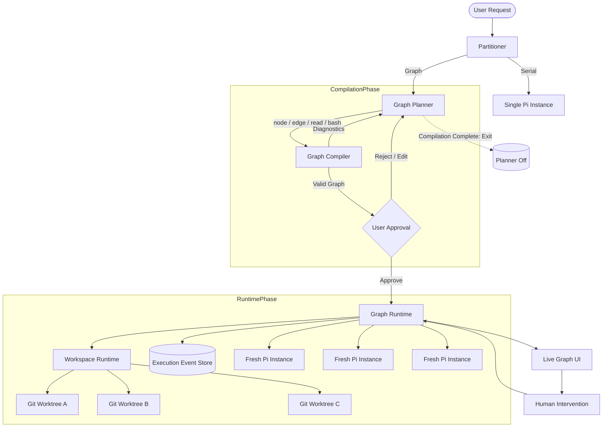

# Grapher — Don't Orchestrate Agents. Compile Work.

> **Core Philosophy**  
> 用少量 Planner 结构化开销换掉大量 Multi-Agent 运行期 Coordination Token。  
> 从始至终都不存在“派发子 Agent”这个 Planner 工具。  
>
> **Pi 只是执行引擎。**  
> Grapher 真正拥有的是：
>
> **Partitioner + Planner + Graph Compiler + Graph Runtime + Workspace Runtime + Graph UI + Human Intervention + Execution History**
>
> Grapher 不在运行时持续 orchestrate agents。  
> Grapher 先把工作**编译成执行图**，随后由确定性的 Runtime 执行这张图。

---

# 1. 核心模型

传统 Multi-Agent 系统通常依赖一个持续在线的 Coordinator：

```text
User
  ↓
Coordinator
  ├── Ask Agent A
  ├── Read A
  ├── Ask Agent B
  ├── Read B
  ├── Ask A again
  ├── Ask Reviewer
  └── ...
```

Coordinator 长时间存活，并持续承担：

- 调度
- 消息转发
- 状态理解
- Agent 选择
- 重试判断
- 上下文维护
- 中间结果总结

这会产生大量 Coordination Token、长上下文和运行时不确定性。

Grapher 将其改造成：

```text
User Intent
    │
    ▼
Partitioner
    │
    ├── Serial ───────────────→ Pi
    │
    └── Graph
          │
          ▼
       Planner
          │
          ▼
       Graph IR
          │
          ▼
       Compiler
          │
          ▼
     Approval Gate
          │
          ▼
     Graph Runtime
       /   |   \
      Pi   Pi   Pi
          ...
```

Planner 只负责：

```text
Intent → Graph IR
```

Compiler 负责：

```text
Graph IR → Validated Execution Plan
```

Runtime 负责：

```text
Execution Plan + Workspace State → Incremental Execution
```

Pi 负责：

```text
Task + Workspace → Work
```

Planner 在 Graph 编译成功后立即退出。

**Planner 不参与运行期协调。**

---

# 2. System Architecture



---

# 3. Partitioner

## 3.1 定位

Partitioner 是 Grapher 的流量入口。

它不负责规划任务，只负责判断：

> 这个任务是否值得承担 Graph Planning 的结构化开销？

重点不是：

> “这个任务理论上能不能拆？”

而是：

> “这个任务是否包含多个能够独立产生有效进展的 substantial workstreams？”

---

## 3.2 Routing

Partitioner 只有一个工具：

```ts
route_task({
  plan_type: "serial" | "graph",
  reasoning: string
})
```

### Serial

适合：

- 单文件修改
- 小型 bug fix
- 简单重构
- 高度线性的任务
- 分解后几乎不存在有效并行度的任务

直接交给一个原生 Pi Instance。

### Graph

适合：

- 前后端并行
- 多模块实现
- 独立研究任务
- 实现 + 独立验证
- 多个能够同时推进的 substantial workstreams

交给 Graph Planner。

---

# 4. Graph Planner

## 4.1 定位

Graph Planner 是一个短生命周期的 **Execution Graph Compiler Frontend**。

它不是：

- Manager
- Coordinator
- Supervisor
- Runtime Agent Router

它只负责：

> 将 User Intent 转换成最小完备的 Task Graph。

---

# 5. Planner Tools

Planner 只有四个工具：

```text
node
edge
read
bash
```

不存在：

```text
spawn_agent
delegate
run_agent
ask_agent
send_message
```

等任何派发 Agent 或运行 Agent 的能力。

Planner 无法直接创建或运行任何 Pi Instance。

其中：

- `node`：创建、修改、删除 Graph Node
- `edge`：创建、修改、删除 Graph Edge
- `read`：读取 Repository / Workspace
- `bash`：检查 Repository / Environment

Graph 中使用语义化的 Node `name` 作为 Planner 可见的唯一标识。

`name` 同时用于：

- Planner 引用 Node
- Edge 引用 Node
- Graph UI 默认展示 Node 名称

Grapher 内部持久化可以另外生成 UUID，但内部 ID 不暴露给 Planner。

---

## 5.1 `node`

`node` 负责创建、修改或删除一个 Graph Node。

```ts
interface NodeToolInput {
  /**
   * 当前 Graph 内唯一的 Node 名称。
   *
   * 应该简短、稳定并具有语义，例如：
   *
   * "api_spec"
   * "frontend"
   * "backend"
   * "integration_test"
   * "security_review"
   */
  name: string;

  /**
   * 给这个 Node Execution 对应 fresh Pi instance
   * 使用的 Specific Task。
   *
   * Agent 不知道 Graph 的存在，因此 task 应该能够独立表达
   * 这个 Node 需要完成的工作。
   *
   * delete=true 时可以省略。
   */
  task?: string;

  /**
   * false / omitted:
   *   Node 不存在 → CREATE
   *   Node 已存在 → UPDATE
   *
   * true:
   *   DELETE Node
   *
   * 删除 Node 时，同时删除所有与该 Node 相连的 Edge。
   */
  delete?: boolean;
}
```

因此：

```text
node(name, task)
```

使用 upsert semantics。

Node 不存在则创建，已经存在则修改。

删除：

```text
node(name, delete=true)
```

---

## 5.2 `edge`

`edge` 负责创建、修改或删除两个 Node 之间的关系。

```ts
interface EdgeToolInput {
  /**
   * Edge 起点。
   * 必须引用已经存在的 Node name。
   */
  from: string;

  /**
   * Edge 终点。
   * 必须引用已经存在的 Node name。
   */
  to: string;

  /**
   * Edge 的语义关系描述。
   *
   * 主要供 Planner、Compiler Diagnostic 和 Graph UI 理解。
   * Runtime 不依赖 relation 文本决定控制流。
   *
   * relation 保持自由文本，不限制为 enum。
   *
   * delete=true 时可以省略。
   */
  relation?: string;

  /**
   * 是否为 Feedback Edge。
   *
   * 必须显式提供。
   *
   * feedback=false:
   *   普通 Dependency Edge。
   *   A → B 表示 B 必须等待 A 成功完成。
   *
   * feedback=true:
   *   Feedback Edge。
   *   当 from Node 输出 <REVISE> 时，
   *   Runtime 沿该 Edge 回到 to Node，
   *   为 to Node 创建一次新的 Execution，
   *   并启动一个 fresh Pi instance。
   *
   * Feedback Edge 可以形成受 Runtime retry limit
   * 控制的 Cycle。
   */
  feedback: boolean;

  /**
   * false / omitted:
   *   Edge 不存在 → CREATE
   *   Edge 已存在 → UPDATE
   *
   * true:
   *   DELETE Edge
   */
  delete?: boolean;
}
```

MVP 中 Edge Identity 为：

```text
(from, to)
```

同一对 Node 之间最多存在一条直接 Edge。

因此再次调用相同 `(from, to)` 的 `edge` 代表修改现有 Edge，而不是创建 Parallel Edge。

---

### Dependency Edge Example

```ts
edge({
  from: "api_spec",
  to: "frontend",
  relation: "frontend implements the API contract",
  feedback: false
})
```

表示：

```text
api_spec → frontend
```

`frontend` 必须等待 `api_spec` 完成。

---

### Feedback Edge Example

```ts
edge({
  from: "frontend_review",
  to: "frontend",
  relation: "requests revision when frontend verification fails",
  feedback: true
})
```

表示：

```text
frontend
    │
    ▼
frontend_review
    │
    │ feedback=true
    ▼
frontend
```

因为 `frontend_review` 存在 outgoing `feedback=true` Edge，Runtime 自动在该 Node 的 Task 末尾追加 Feedback Protocol：

```text
End your response with one of:

<ACCEPT>

<REVISE>

If REVISE, clearly describe the changes needed
```

`<ACCEPT>`：

不触发 Feedback Edge。

`<REVISE>`：

Runtime 沿 Feedback Edge 重新执行 `frontend`，并为新的 Execution 创建一个 fresh Pi instance。

Feedback 的 Routing 由 Graph 决定，而不是由 Reviewer 自己决定。

---

## 5.3 `read`

尽可能直接复用 Pi 原生 `read` 工具定义。

Planner 可以读取：

- Repository structure
- Source files
- Package manifests
- Configuration
- Existing architecture
- README / AGENTS.md
- Build configuration

`read` 用于帮助 Planner 理解真实 Repository，并制定合理的 Graph。

---

## 5.4 `bash`

尽可能直接复用 Pi 原生 `bash` 工具定义。

Planner 可以使用 Bash 检查：

- Repository structure
- Git state
- Dependencies
- Environment
- Build system
- Existing project configuration

Planner 使用 Bash 的目的仍然是：

> **理解环境并制定 Graph。**

不是代替 Node 执行实际开发任务。

---

## 5.5 Graph Mutation & Compiler Validation

每次 `node` / `edge` mutation 都经过 Graph Compiler 的确定性检查。

至少包括：

```text
Node name must be unique.

Node task must not be empty when creating/updating a node.

Edge.from must exist.

Edge.to must exist.

Edge.from must not equal Edge.to.

There may be at most one edge for each (from, to) pair.

Removing all feedback=true edges must leave an acyclic dependency graph.
```

如果 mutation 不合法：

1. 当前 Graph 不发生该次修改。
2. Compiler 返回明确 Diagnostic。
3. Planner 根据 Diagnostic 再次调用 `node` / `edge` 修正。

例如：

```text
Rejected: dependency cycle detected:

api → frontend → api

Normal dependency edges must remain acyclic.
Cycles are only permitted through explicit feedback edges.
```

# 6. Planner Contract

Planner 的具体 System Prompt **暂不在架构规范中固定**。

Planner Prompt 属于需要通过实际运行持续实验和评估的部分，不应该在当前阶段把某一版 Zero-Shot Prompt 当成系统设计本身。

Grapher 在架构层只定义 Planner 必须遵守的 Contract。

## Planner Inputs

Planner 可以获得：

- User Goal
- 当前 Repository / Workspace 的只读可见性
- Graph Compiler 返回的 diagnostics
- Grapher 必要的 execution semantics

## Planner Tools

Planner 只有：

```text
node
edge
read
bash
```

不存在任何：

```text
spawn_agent
delegate
run_agent
ask_agent
```

类型的工具。

## Planner Output

Planner 的唯一核心产物是：

> 一个可以通过 Graph Compiler，并能够交给 Graph Runtime 执行的 Graph。

## Planner 必须理解的 Runtime Semantics

Planner 在规划时需要知道：

- 每一次 Node Execution 都由一个 fresh Pi instance 执行。
- 普通 Dependency Edge 表示执行依赖。
- Feedback Edge 可以产生受控 Cycle。
- 删除所有 Feedback Edge 后，Dependency Graph 必须可以作为 DAG 调度。
- 可以并行执行的 Node 会运行在相互隔离的 Git Worktree 中。
- 并行 Worktree 的修改在下游汇合之前需要重新 composition / merge。
- 因此，任务在逻辑上可并行，并不自动意味着它适合作为两个 filesystem-level parallel nodes。
- Planner 在划分并行任务时需要考虑 task boundary 的 mergeability，尽量避免没有必要的高冲突并行写入。

## Planner 不负责

Planner 不负责：

- 创建或派发 Pi Instance
- 执行任何 Graph Node
- Runtime Scheduling
- 创建或管理 Git Worktree
- 实际执行 Git Merge
- 解决 Runtime Merge Conflict
- Feedback Retry
- Node State Management
- Execution History
- 在 Graph 执行期间继续存活

核心边界：

> **Planner plans for mergeability. Runtime performs merges.**

## Planner Prompt

**TBD / Experimental.**

Planner Prompt 应该通过实际 benchmark 和运行结果逐步确定，而不是由当前架构文档提前固化。

原则上优先保持 Prompt 简洁，并依赖 Graph Compiler 返回确定性的 diagnostics，而不是不断向 Prompt 中加入可以由 Compiler 检查的 corner cases。

# 7. Planner Lifecycle

Planner 生命周期严格限制在 Compilation Phase。

```text
Planner starts
    ↓
Inspect repository
    ↓
Construct graph
    ↓
Compiler validates
    ↓
Compiler rejects?
    ├── yes → Planner fixes graph
    │
    └── no
         ↓
    Compilation complete
         ↓
      Planner exits
```

一旦 Graph 编译成功：

> **Planner 彻底退出。**

执行期间：

```text
Planner Token Usage = 0
```

节点失败不会自动唤醒 Planner。

Feedback 不会唤醒 Planner。

Runtime 不会向 Planner 请求决策。

所有 Runtime 行为由：

- Graph
- Compiler-generated metadata
- deterministic runtime rules
- Pi execution result
- Human Intervention

决定。

---

# 8. Graph Model：允许受控 Cycle

Grapher **不是纯 DAG 系统**。

完整 Graph 允许 Cycle。

但是 Cycle 必须具有明确的 Runtime Semantics。

Graph 中存在两类 Edge。

---

## 8.1 Dependency Edge

```text
A ─────→ B
```

含义：

> B 只能在 A 成功完成后开始。

删除所有 Feedback Edge 后：

> **剩余 Dependency Graph 必须是 DAG。**

因此 Runtime 可以对 Dependency Graph：

- topological sort
- calculate ready nodes
- identify concurrency
- construct execution batches

---

## 8.2 Feedback Edge

```text
Reviewer
    │
    │ feedback=true
    ▼
Implementation
```

Feedback Edge：

- 可以指向已经执行过的节点
- 可以形成 Cycle
- 不参与 Dependency Graph 的拓扑排序
- 只有 `<REVISE>` 才触发
- 受 Runtime retry limit 控制

例如：

```text
Implementation
      │
      ▼
   Reviewer
      │
      │ feedback
      ▼
Implementation
```

这是合法 Cycle。

---

## 8.3 非法 Cycle

例如：

```text
A → B → C
↑       │
└───────┘
```

如果其中没有 Feedback Edge，则非法。

Compiler：

```text
Rejected: dependency cycle detected:

A → B → C → A

Normal dependency edges must form an acyclic graph.
Cycles are only permitted through explicit feedback edges.
```

---

# 9. Graph Compiler

Graph Compiler 是 deterministic static analyzer。

设计原则：

> **Compiler feedback, not prompt teaching.**

不在 Planner Prompt 中提前解释所有 corner cases。

Planner 提交 Graph。

Compiler 检查。

错误则返回精确 diagnostics。

Planner 根据 diagnostics 修改 Graph。

---

## 9.1 Static Analysis

Compiler 至少负责：

### Dependency Cycle Detection

删除 Feedback Edge 后检查 Dependency Graph 是否存在 cycle。

---

### Feedback Validation

Feedback Edge 必须：

- `feedback=true`
- from/to node 均存在
- target 是可重新执行节点
- 不允许 self-feedback
- feedback path 能形成有意义的 bounded retry transition

---

### Dangling Nodes

检测没有实际参与执行结果的孤立节点。

---

### Reachability

检测不可达节点。

---

### Duplicate Node

检测重复或冲突 Node Name。

---

### Invalid Edge

检测不存在的 source / target。

---

### Empty Task

Node 必须拥有有效 Specific Task。

---

### Execution Layers

只针对 Dependency Edge 生成：

```ts
executionBatches: string[][]
```

例如：

```text
Batch 0:
api_spec

Batch 1:
frontend
backend

Batch 2:
integration_test
```

Feedback Edge 不参与 batch topology。

---

## 9.2 Compiler Diagnostics

例如：

```text
E101 DEPENDENCY_CYCLE

frontend → integration_test → frontend

Normal dependency edges must form an acyclic graph.
Use an explicit feedback edge for revision flow.
```

或者：

```text
E204 UNKNOWN_NODE

Edge:
qa_review → frontend_app

Target node "frontend_app" does not exist.
```

Planner 根据 Compiler Feedback 自行修改。

---

# 10. User Approval Gate

Graph 编译通过后：

**不能立即执行。**

右侧 Graph UI 首先展示完整 Execution Graph。

用户可以：

```text
Approve & Start
Edit
Reject
```

只有：

```text
Approve & Start
```

之后 Runtime 才能创建 Pi Instance。

这是 Grapher 的强制 Human Approval Boundary。

---

# 11. Graph Runtime

Graph Runtime 是 Grapher 的核心确定性执行引擎。

它不进行 LLM reasoning。

它负责：

- dependency resolution
- concurrency
- Pi process lifecycle
- worktree lifecycle
- workspace state
- feedback transition
- retry limits
- failure propagation
- dirty propagation
- user intervention
- event recording

---

# 12. Node ≠ Pi Instance

这是 Grapher 的核心约束。

**Graph Node 是稳定的 Task Definition。**

**Pi Instance 是一次 Node Execution Attempt。**

例如：

```text
frontend
│
├── Execution #1
│      └── Pi Instance A
│
├── Execution #2
│      └── Pi Instance B
│
└── Execution #3
       └── Pi Instance C
```

每一次 Execution：

> **必须创建全新的 Pi Instance。**

永远不恢复上一轮 Pi Session 继续执行。

---

## 12.1 Feedback Example

```text
frontend execution #1
        ↓
review execution #1
        ↓
     REVISE
        ↓
feedback edge
        ↓
frontend execution #2
        ↓
review execution #2
```

其中：

```text
frontend #1 ≠ frontend #2
review #1 ≠ review #2
```

四次 execution 对应四个独立 Pi Instance。

旧 Conversation 保留在 Execution History。

---

# 13. Pi Isolation

每个 Pi：

- 是 fresh instance
- 不知道 Graph 存在
- 不知道 Planner 存在
- 没有 graph 工具
- 没有 node/edge 工具
- 没有 spawn agent 工具
- 不负责 scheduling

Pi 只知道：

```text
Specific Task
+
Current Working Directory
```

Pi 使用原生工具工作。

---

# 14. Workspace Runtime

Grapher 不引入额外 Artifact Protocol。

Node 之间不进行：

```text
extract artifact
→ serialize artifact
→ inject artifact into downstream prompt
```

Grapher 不要求 Pi 输出 Grapher-specific artifact schema。

节点之间真正共享的是：

> **Filesystem State**

---

# 15. Git Worktree Isolation

并行 Node 不应该直接写入同一个 working directory。

否则：

```text
frontend ─┐
          ├── package.json
backend ──┘
```

可能产生 filesystem race condition。

因此每个并行 Execution 使用独立 Git Worktree。

例如：

```text
project/
.grapher/
  worktrees/
    run-001/
      frontend/
      backend/
      qa/
```

Pi 启动时：

```text
cwd = assigned_worktree
```

Pi 不需要任何额外 Grapher protocol。

从 Pi 的视角看，它只是在普通 repository 中工作。

---

# 16. Planner Worktree Awareness

Planner **知道 Worktree Isolation 的存在**。

这是 Planner 必须了解的少量 Runtime Semantics 之一。

原因是 Planner 应该尽量构建：

> 可真正并行，而不仅仅是逻辑上并行的任务。

例如两个节点都需要大规模修改：

```text
package.json
database schema
shared generated types
```

Planner 可以据此选择更合理的 task boundary 或 dependency。

但 Planner 不负责：

- 创建 worktree
- merge worktree
- resolve runtime merge
- scheduling

这些全部属于 Runtime。

---
这里需要区分两个不同职责：

> **Planner plans for mergeability. Runtime performs merges.**

Planner 决定两个任务是否应该成为并行 Node 时，不仅考虑它们在语义上是否能够独立执行，也应该考虑它们是否能够作为两个独立 Worktree 中的 filesystem modifications 合理地重新 composition。

因此：

```text
semantic parallelism ≠ filesystem-level parallelism
```

如果两个任务虽然逻辑上可以同时进行，但预期会大量修改相同的 shared files、configuration、schema 或其他高度重叠的 filesystem state，Planner 应该考虑：

- 改变 task boundary
- 增加必要 dependency
- 或采用其他更容易 merge 的 Graph structure

但 Planner **不应该**为了执行 Git 操作而创建：

```text
merge
resolve_worktree
sync_branch
apply_patch
```

之类纯 Runtime Mechanics Node。

实际的：

- Worktree creation
- Workspace composition
- Git merge
- Merge conflict detection
- Worktree cleanup

全部由 Graph Runtime / Workspace Runtime 确定性执行。

# 17. Workspace State

Grapher 不建立 Artifact Layer。

Runtime 只需要追踪：

```text
Filesystem Before
        ↓
Node Execution
        ↓
Filesystem After
```

可以利用 Git tree / commit / revision 表示 Workspace State。

例如：

```ts
interface NodeExecution {
  id: string;
  nodeID: string;

  attempt: number;

  piSessionID: string;

  workspaceRevisionBefore: string;
  workspaceRevisionAfter?: string;

  status: NodeExecutionStatus;

  startedAt: number;
  completedAt?: number;

  error?: string;
}
```

Runtime 不需要理解：

> frontend 生成了哪些“artifact”。

它只关心：

> workspace 从 revision X 变成了 revision Y。

---

# 18. Parallel Workspace Composition

对于：

```text
        A
       / \
      B   C
       \ /
        D
```

B / C 可以分别拥有：

```text
worktree-B
worktree-C
```

当 D 依赖 B 和 C 时，Runtime 必须构造包含两者修改的 Workspace State。

概念上：

```text
state(D)
    =
compose(
  state(A),
  changes(B),
  changes(C)
)
```

Git 提供：

- commits
- trees
- diffs
- merges

作为 Workspace Runtime 的底层机制。

如果修改能够自动合并：

```text
B + C
  ↓
Merged Workspace
  ↓
D
```

如果发生 merge conflict：

```text
B + C
  ↓
Conflict
  ↓
D = BLOCKED
```

Runtime 不应该静默猜测复杂语义冲突。

冲突应作为 Graph Runtime Event 暴露给用户。

---

# 19. Feedback Protocol

任何拥有 outgoing：

```text
feedback=true
```

Edge 的 Node，Runtime 自动在其 Task 末尾追加：

```text
End your response with one of:

<ACCEPT>

<REVISE>

If REVISE, clearly describe the changes needed
```

不需要：

- Reviewer Tool
- Reviewer Agent Type
- Reviewer Runtime
- predefined reviewer role

Reviewer 只是普通 Pi Node。

---

# 20. Feedback Routing

例如：

```text
frontend
   │
   ▼
qa_review
   │
   │ feedback=true
   ▼
frontend
```

如果：

```text
qa_review
```

输出：

```text
<ACCEPT>
```

Feedback Edge 不触发。

如果输出：

```text
The login flow fails when the session expires.

<REVISE>
```

Runtime：

```text
qa_review
    ↓
feedback edge
    ↓
frontend
```

重新执行 frontend。

Feedback 的目标由：

> **Graph Edge**

决定。

不是由 Reviewer 输出决定。

因此：

> Routing belongs to Graph.  
> Evaluation belongs to Pi.  
> Transition belongs to Runtime.

---

# 21. Feedback Retry Limit

Feedback Cycle 必须 bounded。

默认：

```text
max feedback attempts = 3
```

例如：

```text
frontend
   ↓
review
   ↓ REVISE #1
frontend
   ↓
review
   ↓ REVISE #2
frontend
   ↓
review
   ↓ REVISE #3
frontend
   ↓
review
   ↓ REVISE #4
HALT BRANCH
```

超过限制：

```text
branch = FAILED
```

但：

> **整个 Graph Runtime 不 halt。**

无关分支继续执行。

---

# 22. Node Runtime States

```ts
type NodeStatus =
  | "waiting"
  | "running"
  | "blocked"
  | "done"
  | "failed"
  | "dirty";
```

### WAITING

依赖尚未满足。

### RUNNING

存在 active Pi execution。

### BLOCKED

例如：

- workspace merge conflict
- required upstream branch failed
- waiting for human resolution

### DONE

当前 Node Revision 已成功执行。

### FAILED

- Pi execution failed
- feedback retry exhausted
- unrecoverable runtime error

### DIRTY

因为 Human Intervention 或 upstream change，当前结果已经失效。

---

# 23. Event-Sourced Runtime

Graph Runtime 不应只保存：

```text
node.status = running
```

Grapher 使用 append-only Execution Event Log。

例如：

```ts
type GraphEvent =
  | {
      type: "graph.approved";
      timestamp: number;
    }
  | {
      type: "node.started";
      nodeId: string;
      executionId: string;
      timestamp: number;
    }
  | {
      type: "node.completed";
      nodeId: string;
      executionId: string;
      timestamp: number;
    }
  | {
      type: "node.failed";
      nodeId: string;
      executionId: string;
      error: string;
      timestamp: number;
    }
  | {
      type: "feedback.accepted";
      nodeId: string;
      executionId: string;
      timestamp: number;
    }
  | {
      type: "feedback.revision_requested";
      fromNode: string;
      toNode: string;
      feedback: string;
      timestamp: number;
    }
  | {
      type: "node.invalidated";
      nodeId: string;
      reason: string;
      timestamp: number;
    }
  | {
      type: "workspace.merge_conflict";
      nodeId: string;
      timestamp: number;
    }
  | {
      type: "user.intervened";
      nodeId: string;
      instruction: string;
      timestamp: number;
    };
```

当前 Runtime State：

```text
Graph Definition
      +
Execution Event Log
      ↓
State Reducer
      ↓
Current Graph State
```

---

# 24. Execution History

因为 Runtime 是 Event-Sourced 的，所以 Grapher 天然拥有完整 Execution History。

例如：

```text
10:31 api started
10:33 api completed

10:33 frontend started
10:33 backend started

10:37 backend completed
10:39 frontend completed

10:40 qa started
10:42 qa requested revision → frontend

10:42 frontend execution #2 started
10:46 frontend completed

10:47 qa execution #2 started
10:49 qa accepted
```

Conversation History 同样按照：

```text
Node
  ↓
Execution Attempt
  ↓
Pi Session
```

组织。

---

# 25. Human Intervention

Human Intervention 是 Grapher Runtime 的一等能力。

用户可以点击：

```text
frontend
```

然后直接输入：

```text
这里不要 React，换 Svelte。
```

系统不会重新运行整个 Graph。

---

# 26. Node Revision

Human Intervention 不应该覆盖历史 Execution。

逻辑上：

```text
frontend revision 1
        ↓
User Intervention
        ↓
frontend revision 2
```

UI 可以仍然显示：

```text
frontend
```

但 Execution History 保留所有历史版本。

---

# 27. Dirty Subgraph Invalidation

用户修改 Node 后：

```text
changed node
     +
dependency downstream
     ↓
DIRTY
```

例如：

```text
api
├── frontend
│      ↓
│   screenshot
│
└── backend
       ↓
backend_test

frontend + backend
       ↓
 integration
```

用户修改 frontend：

```text
DIRTY:
frontend
screenshot
integration

UNCHANGED:
api
backend
backend_test
```

Runtime 只重新执行受影响子图。

---

# 28. Live Graph UI

右侧不是静态 Mermaid 图。

它是：

> **Live Execution Graph**

每个节点实时展示：

```text
WAITING
RUNNING
BLOCKED
DONE
FAILED
DIRTY
```

---

# 29. Graph Interaction

## Hover

Hover Node：

```text
Node Name
Specific Task
Dependencies
Outgoing Feedback Edges
Execution Attempts
Feedback Iteration
Current Worktree
Current Status
```

---

## Click

点击 Node：

左侧立即切换到该 Node 当前/历史 Pi Instance Conversation。

用户可以查看：

- conversation
- tool calls
- shell output
- execution attempts
- feedback history
- errors

---

# 30. Split View

```text
+--------------------------------+--------------------------------+
|      PI CONVERSATION           |       LIVE GRAPH               |
|                                |                                |
| frontend                       |             api                |
| Execution #2                   |              │                 |
|                                |          ┌───┴───┐             |
| User intervention:             |          │       │             |
| "换成 Svelte"                  |      frontend backend          |
|                                |          │       │             |
| Pi:                            |          └───┬───┘             |
| > reading repo...              |              │                 |
| > editing...                   |             qa                 |
| > npm test                     |              │                 |
|                                |      feedback → frontend       |
|                                |                                |
| [Send instruction]             | [Approve] [Pause] [Rerun]     |
+--------------------------------+--------------------------------+
```

---

# 31. Technology Stack

Grapher 定位为本地浏览器前端与终端后端 Agent Runtime。

推荐技术栈：

```text
HTTP API + Browser UI
│
├── Rust Core
│   ├── Graph Compiler
│   ├── Graph Runtime
│   ├── Scheduler
│   ├── State Reducer
│   ├── Pi Process Manager
│   ├── Workspace Manager
│   ├── Git Worktree Manager
│   └── SQLite Event Store
│
└── React + TypeScript
    ├── Vite
    ├── @xyflow/react
    ├── Zustand
    ├── TanStack Query
    └── xterm.js
```

---

# 32. Rust Core Responsibilities

Rust Core 是 Grapher Runtime Authority。

负责：

```text
Graph compilation
Graph validation
Scheduling
Concurrency
Child process management
Signals
Pi lifecycle
Git worktree lifecycle
Workspace composition
Feedback state model
Retry limits
Event persistence
Crash recovery
```

核心接口可以类似：

```rust
compile(graph) -> Result<ExecutionPlan, Vec<Diagnostic>>
```

Runtime：

```rust
apply_event(state, event) -> state
```

---

# 33. React UI Responsibilities

React 不拥有 Runtime Truth。

React 负责：

- Graph visualization
- Conversation rendering
- execution timeline
- hover inspector
- user intervention
- approval gate
- terminal rendering
- runtime controls

真实状态来自 Rust Runtime + Event Store。

---

# 34. Persistence

使用：

```text
SQLite
```

保存：

- Projects
- Graph Definitions
- Node Revisions
- Execution Attempts
- Pi Session metadata
- Graph Events
- Feedback history
- User interventions
- Workspace revision metadata

Filesystem / Git 保存实际代码状态。

SQLite 保存 Grapher execution state。

---

# 35. Core TypeScript Graph Schema

```ts
export type NodeStatus =
  | "waiting"
  | "running"
  | "blocked"
  | "done"
  | "failed"
  | "dirty";

export interface GraphNode {
  id: string;
  task: string;
}

export interface GraphEdge {
  id: string;

  from: string;
  to: string;

  relation?: string;

  /**
   * false = dependency
   * true = bounded feedback transition
   */
  feedback: boolean;
}

export interface GraphDefinition {
  id: string;

  originalGoal: string;

  nodes: GraphNode[];
  edges: GraphEdge[];

  createdAt: number;
}
```

---

# 36. Compiled Execution Plan

```ts
export interface CompiledExecutionPlan {
  graphId: string;

  /**
   * Computed using dependency edges only.
   */
  executionBatches: string[][];

  roots: string[];
  terminals: string[];

  feedbackPolicies: FeedbackPolicy[];

  approvedByUser: boolean;
}

export interface FeedbackPolicy {
  fromNode: string;
  toNode: string;

  maxAttempts: number;
}
```

---

# 37. Execution Attempt

```ts
export interface NodeExecution {
  id: string;

  nodeId: string;
  nodeRevision: number;

  attempt: number;

  piSessionId: string;

  worktreePath: string;

  workspaceRevisionBefore: string;
  workspaceRevisionAfter?: string;

  status:
    | "running"
    | "completed"
    | "failed";

  startedAt: number;
  completedAt?: number;

  error?: string;
}
```

---

# 38. Example

用户：

> 我需要做一个兼顾前后端的 XXX 项目。

Partitioner：

```text
graph
```

Planner 检查 repository。

然后：

```text
api_spec
   │
   ├──────────────┐
   ▼              ▼
frontend       backend
   │              │
   └──────┬───────┘
          ▼
       qa_review
          │
          │ feedback
          └────────────→ frontend
```

Dependency edges：

```text
api_spec → frontend
api_spec → backend

frontend → qa_review
backend → qa_review
```

Feedback edge：

```text
qa_review → frontend
feedback=true
```

---

# 39. Compilation

Compiler 删除 Feedback Edge 后得到：

```text
api_spec
   │
   ├──────────────┐
   ▼              ▼
frontend       backend
   │              │
   └──────┬───────┘
          ▼
       qa_review
```

这是 DAG。

因此生成：

```text
Batch 0
api_spec

Batch 1
frontend
backend

Batch 2
qa_review
```

完整 Execution Graph 本身则包含受控 cycle。

---

# 40. Execution

用户 Approve。

Runtime：

```text
api_spec
↓
fresh Pi
↓
DONE
```

随后创建两个 isolated worktrees：

```text
frontend worktree
backend worktree
```

并发启动：

```text
fresh Pi(frontend)
fresh Pi(backend)
```

两者完成。

Runtime composition workspace。

随后：

```text
fresh Pi(qa_review)
```

Runtime 自动追加 Feedback Protocol。

QA：

```text
The login form fails when the session expires.

<REVISE>
```

Runtime 读取 Graph：

```text
qa_review
   │
   │ feedback=true
   ▼
frontend
```

于是：

```text
frontend execution #2
```

启动一个**全新的 Pi Instance**。

完成后重新执行受影响的 downstream path。

QA 再次执行，同样是 fresh Pi。

最终：

```text
<ACCEPT>
```

Feedback Edge 不触发。

Branch 完成。

---

# 41. Product Principle

Grapher 不应该逐渐演化成：

> 一个拥有越来越聪明 Coordinator 的 Multi-Agent Framework。

它应该坚持：

```text
Intelligence during planning
        ↓
Structured Graph
        ↓
Deterministic Compiler
        ↓
Deterministic Runtime
        ↓
Independent Pi Executions
```

能由：

- Graph
- Compiler
- Runtime
- Git
- State Model

确定性解决的问题，不交给另一个 LLM Coordinator。

---

# 42. Future Engine Abstraction

MVP 只支持 Pi。

但 Runtime Architecture 不应该把 Node 与 Pi 强绑定。

未来可以抽象：

```ts
interface AgentEngine {
  start(config: ExecutionConfig): Promise<AgentSession>;
  interrupt(sessionId: string): Promise<void>;
  terminate(sessionId: string): Promise<void>;
}
```

未来：

```text
Node A → Pi
Node B → Codex
Node C → Claude Code
Node D → Local Agent
```

但这不是 MVP 的目标。

**MVP 只证明 Pi + Compiled Work Graph。**

---

# 43. Grapher 真正拥有的资产

Pi 可以替换。

模型可以替换。

底层 Agent Runtime 可以替换。

Grapher 真正拥有的是：

```text
Planner
Graph IR
Compiler
Graph Runtime
Workspace Runtime
Execution State
Graph UI
Human Intervention
Execution History
```

因此 Grapher 不是：

> Multi-Agent Chat UI

也不是：

> Agent Orchestrator

而是：

> **Agent Work Compiler + Incremental Execution Runtime**

---

# 44. Final Mental Model

```text
                    GRAPHER

                  User Intent
                       │
                       ▼
                   Partitioner
                       │
              ┌────────┴────────┐
              │                 │
           Serial             Graph
              │                 │
              ▼                 ▼
             Pi              Planner
                                │
                                ▼
                            Graph IR
                                │
                         diagnostics ↺
                                │
                                ▼
                            Compiler
                                │
                                ▼
                         Approval Gate
                                │
                                ▼
                         Graph Runtime
                        /      |      \
                       /       |       \
                  fresh Pi  fresh Pi  fresh Pi
                      │         │         │
                  worktree  worktree  worktree
                       \        |        /
                        \       |       /
                         Workspace State
                                │
                          Feedback Cycles
                                │
                         Human Intervention
                                │
                                ▼
                        Execution History
```

核心不变量：

> **Planner plans. Compiler validates. Runtime executes. Pi works. Git carries workspace state. Humans intervene. Events preserve history.**

以及：

> **Don't orchestrate agents. Compile work.**