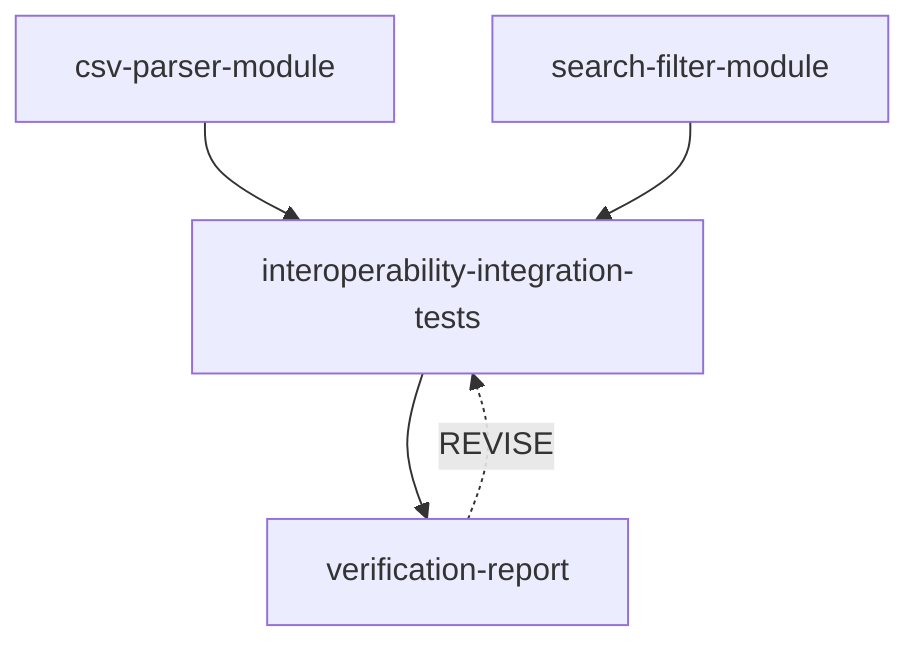

# 2026-09-14 Computer Use 实测与修复记录

本次以真实模型、真实 Pi、macOS sandbox 和 Git worktree 运行 Graph。界面提交、审批、查看节点、暂停、介入、继续均由 computer use 完成；终端只用于构建、读日志、独立验证与修复代码。没有导入手写图，也没有用 fixture 代替真实模型。

**初始结论：图可编译，职责覆盖和实现并行成立，但自动运行未一次成功；规划开销较高，验证职责重复，集成节点出现过度扩展与错误测试。局部恢复结果见下方最终记录。**

## 运行身份与取证边界

- 基线代码：`a44bc5c`。模型 `qwen3.8-flash`，并发 2，feedback 上限 3。测试期间不调整模型或思考预算。
- 正式服务：`http://127.0.0.1:1457`；数据目录 `/private/tmp/grapher-cu-20260914/runtime-current`。
- 测试目标目录：`/private/tmp/grapher-cu-20260914/catalog`，普通目录，由宿主维护 shadow Git metadata。
- 正式 planning ID：`d5050b7d-4dfd-4b07-8256-30e31b32fba9`；run ID：`035972f3-4e96-40c2-b7d7-678f830c268f`。
- [原始契约](contract.md)、[实际生成图和原始目标](current/graph.json)、[工具轨迹](current/planner-tools.json)、[规划指标](current/metrics.json)、[运行事件](current/runtime-events.json)、[每次执行指标](current/executions.json)。工具轨迹不含模型内部推理文本，保留时间、参数、结果与错误标志。
- 1420/1421 上原本运行的是旧后端，加载了较早的 planner 提示词和扩展。其“工具错误标成成功”和 Provider `Unknown command` 现象在新构建中不再复现，**不计入当前未修复缺陷**。旧版仅保留在 `stale-server/`，不能与正式样本做受控 A/B 比较。
- 第一次启动新后端时，Codex 外层文件权限使 Pi 无法建立 settings lock，导致模型初始化失败。这是环境限制；但后端吞掉错误并自动路由 Serial 是独立的软件缺陷，见 F1。正常宿主权限下无需更改认证即可实际路由 Graph。

## 不以示例图作为金标的质量评估

评估对象是原始用户目标、真实仓库契约和运行结果；不要求固定节点数、固定形状，也不要求一定有 feedback 边。每项 0–2 分仅是本次人工诊断标尺，不是统计 benchmark。

| 维度 | 分数 | 证据与判断 |
| --- | ---: | --- |
| 目标覆盖 | 2 | parser、search、各自单测、互操作验收、完整测试和报告均有责任人。 |
| 自包含与契约忠实 | 2 | tasks 引用真实 README，保留 `maxPrice = Infinity`；使用相对路径，未把 worker 绑定到 Planner 原目录。 |
| 并行与可合并性 | 2 | 两路实现无普通依赖边，分别写 csv/search 文件和各自测试；实际同一毫秒启动，汇合成功无冲突。 |
| 任务边界与效率 | 1 | 集成节点与最终报告节点都可修复且需要全量测试；新增一层是否提供独立审查证据未说清楚。四节点不是错误，但有重复工作。 |
| 验证及反馈设计 | 1 | 报告→集成的 feedback 在编译上合法且有界；报告 task 自身要求修复直至通过，没有清楚说明什么情况应该请求上游修订。集成 task 又提及“回到负责的工作流”，但它没有 outgoing feedback，不能自行选择路由。 |

**本次图结构诊断：8/10；规划效率偏低；执行可靠性未通过首次运行。** 编译通过和人工结构评分均不能替代最终行为验证。

实际图：

更紧凑的候选方案是两路实现汇入一个“集成验收并报告”节点；如果需要独立复核，也可保留第四节点，但必须明确它增加的独立证据。这是建议，不是唯一正确图。

## Planner 活动和时间

时间来自 Pi session ISO 时间及 SQLite 事件时间。下表为 session 首条至末条事件跨度；模型初始化/进程启动开销单独体现在阶段间隙。token 是 provider 报告值的逐响应累加，cacheRead 会重复计量上下文，不能称为新增输出 token，费用字段为 0 也不代表免费。

| 阶段 | 用时 | 活动 |
| --- | ---: | --- |
| Partitioner | 3.919 秒 | 1 次 assistant 响应、0 工具，输出 Graph。 |
| Planner | 182.284 秒 | 11 次 assistant 响应、18 次工具调用，4 次明确失败。 |
| 分类开始→图持久化 | 187.971 秒 | 包括阶段启动间隙及最终编译。 |
| 最后一次 graph mutation→Planner 退出 | 47.037 秒 | 结构已被接受后仍有明显收尾开销；没有执行工作成果。 |
| 审批等待 | 44.133 秒 | 操作者查看图与点击审批，不能计为模型耗时。 |

Planner 18 次调用包括 10 次检查（8 bash、2 read）和 8 次 mutation（4 node、4 edge）。检查失败为：shell chaining/cd、`ls -R`、`node --version`、一次 ls 多目录。只读边界正确拒绝；但模型没有有效遵循已提供的语法。`find . -type f -maxdepth 3` 已确认仅存在 README 和 package.json，后续又检查空目录；检查和实现环境探测偏多。

Planner usage：input 12,643，cacheRead 31,744，output 5,619（其中 reasoning 3,505），totalTokens 50,006。Partitioner totalTokens 431。正式图 mutation 无编译诊断失败；旧进程出现的非法节点名不混入此指标。

## 首次执行与局部恢复

| 节点／尝试 | 墙钟时间 | 结果 |
| --- | ---: | --- |
| csv-parser-module #1 | 235.940 秒 | DONE，15 工具调用。 |
| search-filter-module #1 | 377.333 秒 | DONE，23 工具调用。 |
| interoperability-integration-tests #1 | 1,635.655 秒 | FAILED，宿主报告 900 秒 timeout；19 工具调用，3 次工具错误。 |
| verification-report #1 | 未启动 | 因上游失败 BLOCKED。 |

两路实现重叠约 235.940 秒，第一层约 377.333 秒，相比两节点时间直接相加节省约 235.940 秒；这不是相对于单 agent 的总体加速比。并行收益被规划与集成节点额外开销明显稀释。

集成 #1 执行：重复尝试读取被隔离的 Git metadata、把临时 ESM probe 放到 `/tmp` 导致相对 import 失败、执行几千次额外探测、编写约 700 行集成测试、模型请求出现 `terminated` 后继续重试，最终超时。进程退出事件记录 `elapsedMs=900052`，说明单调时钟预算在 900.052 秒触发；墙钟跨度为 1,635.655 秒。两种时钟可能受休眠影响，本次没有系统电源事件证据，不将其归因为 deadline 实现错误。

对失败工作区独立执行 `node --test tests/integration.test.mjs`：**34 项中 31 通过、3 失败**，见 [完整输出](current/failed-integration-test-output.txt) 和 [失败测试原件](current/failed-integration.test.mjs.txt)：

1. 把 `dgt, lar` 错当成 `Widget, large` 的子串。
2. 比较两次独立 parse 返回数组的引用相等，超出 API 契约。
3. 随机测试生成器没有生成非法输入，却断言必须拒绝至少若干项。

这三项说明测试质量不足，不能用它们证明模块实现有三处缺陷。另有 `assert.equal(result, items ? result : result)` 等自证断言以及测试自身命名/源码检查，增加代码量却不能有效验证业务结果。

通过 UI 暂停→对集成节点提交补充指令→继续：要求聚焦原始契约、有限确定性样例、立即运行真实测试、不调查 Git、不做额外 fuzzing、自证断言或测试文件自检。事件将集成及其后继失效，两路 DONE 实现保持不变；集成 #2 使用新的 session 和 worktree，#1 仍可在下拉框查看。#2 用时 292.943 秒，17 次工具调用，无工具错误，12 项集成测试及全部 88 项测试通过。这是人工恢复，**不能计为原始图的无介入成功**。

## 当前代码问题及修复

| ID | 问题和影响 | 本次处理 |
| --- | --- | --- |
| F1 / P1 | `partition_result.unwrap_or_default()` 把认证、启动、请求错误转成空分类，再自动 Serial 执行，绕过本应由成功分类决定的审批路径。 | 改为保留 partition.jsonl 后传播 `Partitioner failed`，不发 route、不创建/审批图。新增实际失败进程回归，检查旧 run 未变、无 execution、无 route.json、planning 锁释放。 |
| F2 / P2 | 手工修改目录并保存后标题仍显示旧仓库，用户无法可靠判断目标。 | 保存时检测并 canonicalize 新目录，同步 repoInfo 和项目列表；Header 只接受与当前路径匹配的元数据。 |
| F3 / P2 | 审批弹窗同时宣称“自动合并回源目录”和“完全不修改主目录”。 | 明确隔离执行与最终写回，并显示实际目标路径。 |
| F4 / P2 | 节点会话只显示开始时刻，没有已用时间或结束时间，难以评估活动成本。 | 添加基于持久化 startedAt/completedAt 的 ExecutionTiming；运行时刷新，结束后冻结，历史尝试可回看。 |
| F5 / P2 | 失败或暂停时 footer 仍称“运行时正在推进”，BLOCKED 无尝试节点又显示“就绪”。 | Footer 随真实 phase 显示停止/暂停/完成；无尝试统一显示“尚未执行”。 |
| F6 / 文档 | agent.md 和 .env.example 仍描述已废弃 route_task 分类接口；示例还要求最小节点数。 | 同步为无工具文本分类，明确调用失败不降级；删除示例中的最小图目标。 |

未在本次硬改的质量问题：Planner 检查轮次多、任务完成后收尾慢、重叠验收职责、feedback 触发责任含糊；worker 对沙箱 Git 的误解和过度验证。没有把固定节点数、最大调用次数或某张示例图写成新的硬约束。

未补齐的可观测性：刷新后 UI 保留执行历史，但 Planner 的工具轨迹只在当前前端会话可见，历史图未提供持久化的规划耗时/usage 查看入口。本报告从磁盘日志补齐证据，不把“界面仍可完整重放规划”记为通过。

## 验证

- TypeScript 检查与 Vite production build 通过。
- Rust 40 项测试覆盖编译、审批、失败传播、反馈、局部失效、回写、shadow repo 和 sandbox；普通受限环境下前三个 OS sandbox 测试因嵌套 sandbox_apply 权限失败，随后以正常宿主权限重跑 sandbox + shadow，4 项通过。其余 36 项通过。
- 本次新增 F1 回归通过；它调用失败的本地假进程，不调用计费模型。
- Computer use 已确认 Graph 审批前 0 attempts、两路并行 RUNNING、失败 BLOCKED、局部介入产生新 attempt、旧尝试耗时保留。

## 最终记录

恢复后 Graph **4/4 完成，已写回工作文件夹**，由 computer use 界面确认。最终 verifier 用时 335.080 秒，28 次工具调用，工具错误标志为 0；包含 42 项额外契约探测，也有重复测试与被管道掩盖退出码的 Git 访问失败。因此“0 工具错误”不等于每条子命令成功。

从集成 #2 启动到发布完成共 629.564 秒，发布完成时间 2026-09-14T01:33:35.732000+00:00。此前数小时等待人工恢复，不计为模型执行耗时。发布 SHA：`4776e87bdd3f9126804645afad0478b0c47b1711`。

在发布目录独立重跑 `npm test`：**88/88 通过，退出码 0**；另运行本报告作者编写的 [9 项行为验收](acceptance.mjs)：**9/9 通过**。见 [全量测试结果](current/published-test-output.txt) 与 [独立验收结果](current/independent-acceptance.json)。README 与原始契约逐字节一致，package.json 保留原始内容，源目录没有 `.git`，shadow Git 状态干净。

最终产出的 VERIFICATION.md 仍有质量问题：约 200 行偏离“简短报告”；把默认导出、额外容错等实现选择当作契约检查；以运行快、无挂起句柄推断无网络访问，证据不足。其 PASS 结论只适用于已检查样例，不能证明不存在缺陷。报告副本保存在 [published-verification.md](current/published-verification.md)。

本项目最终 TypeScript/Vite 构建与 `git diff --check` 通过。已观察新耗时组件的实时和历史显示；目录保存同步与审批文案完成代码修复和构建检查，尚未补做完整 UI 回归。1457 保留本次完成结果；为快速收尾未重启服务加载最新 Rust 修复，后端修复已编译并由回归测试验证。

后续优先级、修改范围和验收条件见 [修复计划](fix-plan.md)。
