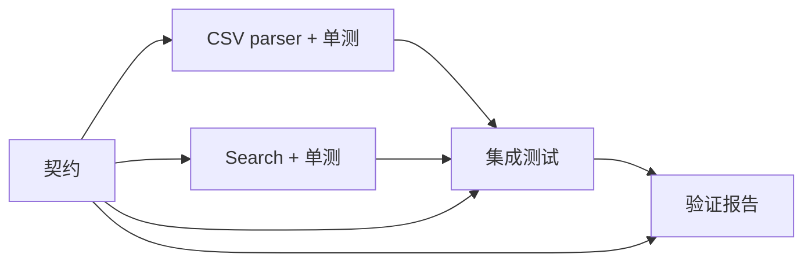

# Grapher 实跑审计（2026-09-21）

本次不修改任何系统/角色提示词、judge 提示词、tool description 或工具参数说明。保留用户原有 `src/styles.css` 修改。证据使用本机时间和固定采样，不因失败反复采样至通过。

## 已完成的检查与修复

| 项目 | 观察 | 处理 |
|---|---|---|
| Planner 隐式推理预算 | 未设置 `PLANNER_THINKING` 时继承共享 Pi 的 high，P004 用时 769.332 秒 | Planner 默认显式 medium，环境变量仍可覆盖 |
| 角色超时 | README 的 `*_TIMEOUT_SECONDS` 原先没有执行实现 | 默认 900 秒、正整数校验；任务 stdin 异步投递也受同一截止时间约束；超时杀进程组，记录 `timedOut` 与失败结果；用 1 MB 输入覆盖静默、持续输出、关闭管道后仍存活的子进程 |
| 规划统计 | UI 过滤 partition，Token 总计漏算；serial 缺失消耗 | 总计与角色明细纳入 partition；13 项 UI 回归通过 |
| 失败分片器回归 | 测试空 model 在 preflight 先失败，未真正走到子进程失败 | 使用 mock/model，重新覆盖失败留痕与不创建/批准 run |
| 评测协议过期 | 仍要求 route_task；只认可批量 node/edge | 对齐生产无工具 serial/graph 回复及单条/批量图调用；修改 grader 版本 |
| stderr 误判 | events.jsonl 中合法 `[stderr]` 警告导致整份工具证据解析失败 | 只跳过宿主 stderr 前缀，坏 JSON 仍失败；保留原始证据 |
| 外置 harness 路径 | B008/B011、E2E 源码清单引用迁移前路径 | 修正外置路径与依赖解析；B011 恢复通过 |
| 旧 E2E 页面定位 | 欢迎文案、设置按钮、Approve 文案已变化 | 对齐当前页面，保留三次失败启动记录 |
| 认证目录差异 | benchmark 直接使用旧 Pi CLI 的认证，生产默认目录没有相同模型 | E2E 显式传入已有 `PI_CODING_AGENT_DIR=$HOME/.pi/agent`，未复制或改写凭据 |

轨迹分析命令：

```sh
node scripts/planning-trajectory.mjs /path/to/events.jsonl
```

该脚本保留调用参数、错误、首条模型活动、首次图修改、Token、工具时间区间并集。`nonToolWallMs` 包含模型生成、网络、启动与调度，不能直接解释成纯推理时间。并发工具区间去重已用重叠区间样例验证。

## P004 预算对照（各一次）

| 指标 | 基线（实际 high） | 显式 medium |
|---|---:|---:|
| Planner 墙钟 | 769.332 秒 | 84.048 秒 |
| 节点数 | 4 | 4 |
| 编译 | 通过 | 通过 |
| 语义 judge | 13/14 | 14/14 |
| 综合图质量 | 不通过 | 不通过 |
| 原因 | 额外验证报告节点，反馈归属不合理 | 额外验证节点 |

medium 用时减少约 89.1%，但这是一次配对观察，存在模型随机性、服务端时延和并发负载影响，不是统计保证。没有为得到更好评分更改用户任务或 judge。基线会话的 `thinking_level_change` 明确为 high，对照为 medium。

基线第一次图修改在约 655 秒；之前工具总墙钟仅约 1.8 秒。Planner 实验 Node 原生 TypeScript 支持、枚举/parameter property 限制，并为前后端制定细致 API。环境探索本身有价值，但图任务约 18.9K 字符且引入未请求的验证报告，说明过度细化和增加流程是实际问题。medium 任务文本约 4.9K 字符，依然多出验证节点，所以调整预算没有解决图经济性。

P004 原始评测未评分的直接原因是 stderr 解析失败。重新评审复用原始候选图，没有重新生成；重新评分之后仍失败，未隐藏模型问题。

P004 在 727 秒尝试让一个 verifier 同时 feedback 到 server 和 web，Compiler 返回 E208 并原子拒绝。模型随后改为回到 integration，满足结构规则，却没有给 integration 足够修复权限。这说明工具失败与可理解的诊断有帮助，但“编译通过”无法保证修订语义正确；错误次数本身未扣质量分。

证据：

- [六案例原始基线](../../grapher-benchmark-results/audit-baseline-2026-09-21T03-10-01-456Z/)
- [P004 原图重新评审](../../grapher-benchmark-results/audit-p004-rejudge-2026-09-21T03-24-39-967Z/)
- [P004 medium 对照](../../grapher-benchmark-results/audit-medium-2026-09-21T03-25-32-403Z/)

## P005 原图评审

规划用时 591.447 秒，6 节点、8 条边，工具 19 次，其中 2 次失败（一次 node 参数格式错误、一次多目标 feedback 的 E208；均修正），工具墙钟并集仅 1.955 秒。契约→双 SDK→各自 review→conformance，两条 feedback 分别回到对应 SDK，编译通过。人工结构检查可见职责和并行关系合理，但任务文本约 20.9K 字符，仍有规划过细的成本。

唯一一次原图 judge 给出了语义维度分数，但 `mergeability` 的 evidence 使用 `{edge: ...}`，违反 node+line 的证据协议。grader 返回 `JUDGE_FAILURE: Ungrounded judge evidence for mergeability`，因此此样本**未评分**，不能把未经证据校验的分数纳入平均分；没有重试或放宽证据标准。

[评审证据](../../grapher-benchmark-results/audit-p005-rejudge-2026-09-21T03-34-04-880Z/)。

## 六案例汇总

| 案例 | 期望/实际路由 | 分片耗时 | Planner 耗时 | 编译 | 原图评审结论 |
|---|---|---:|---:|---|---|
| P001 局部规范化 | serial / serial | 9.000s | — | — | 路由通过 |
| P002 CSV 顺序优化 | serial / graph | 5.061s | — | — | 错误路由，顺序工作被拆图 |
| P003 机械重命名 | serial / graph | 3.217s | — | — | 错误路由，机械跨文件工作被拆图 |
| P004 endpoint + browser | graph / graph | 3.431s | 769.332s | 通过 | 13/14，但经济性与反馈归属不通过 |
| P005 双 SDK + review | graph / graph | 4.190s | 591.447s | 通过 | judge 证据无效，未评分 |
| P006 独立审计 + 汇总 | graph / graph | 6.554s | 282.571s | 通过 | judge 证据无效，未评分 |

路由正确 4/6；无工具单词回复协议实际为 6/6。原始 report 的 protocol=FAIL 是旧 grader 导致，修复后保留原报告不覆盖。三个 Planner 都来自 high 会话（已逐个核对 session 事件），每案固定一次。原始全套耗时约 28 分钟，主要来自模型规划。

P006 的一次复用原图 judge 同样出现 `Ungrounded judge evidence for mergeability`，未重新抽样。人工检查其 4 节点为 auth audit、storage audit、release synthesis、额外 verify-reports；并行审计正确，但最后的复核重复审计/汇总工作。该人工发现不是经有效 judge 验证的评分。

[最后一案评审证据](../../grapher-benchmark-results/audit-p006-rejudge-2026-09-21T03-38-34-938Z/)。

## 生产浏览器链路

使用独立临时 Git 项目，通过浏览器设置目录、提交目标、等待图、批准、执行、发布和独立验收。原始入口失败也保留：03:12 欢迎文案失效，03:15 设置按钮失效，03:17 认证目录不同导致模型找不到；03:21 为进入真实执行的本次样本。

- Partitioner 5.047 秒，Planner 86.842 秒，规划总计 91.964 秒。
- 5 节点、7 dependency edges；契约→parser/search 并行→integration→verification；无 feedback。
- Planner 9 次工具调用、2 次错误；错误分别是探测不存在的目录和 `.gitignore`，已有有效输出，模型继续完成规划。这是正常环境探索，不判质量失败。
- Planner 工具墙钟仅 0.133 秒；首图修改 41.722 秒；总 Token 37,325。
- 已实测契约 415.433 秒、parser 465.244 秒、search 379.322 秒、integration 366.700 秒、verification 641.935 秒；两实现分支确实重叠执行。执行墙钟 1,891.018 秒（31 分 31 秒），浏览器 E2E 总计 1,994.313 秒（33 分 14 秒）。
- 契约产物 247 行、约 19 KB；parser 单测 366 行、约 17 KB；search 单测 252 行、约 12 KB。大量验收编号、逐项映射和重复运行要求放大了下游生成成本。
- 图职责清晰、文件所有权互斥、依赖与并行关系符合显式目标。
- 仍有语义缺陷：所有任务绑定源项目绝对路径，依赖现有兼容映射才能执行；添加大量重复测试；契约加入未明确要求的细节；只读 integration/verification 没有失败回到实现负责人的修订路径。
- verification 的 `git status` 只能证明本节点当前修改，不能证明祖先累计变更遵守七路径限制；E2E 独立使用 baseline..HEAD 检查。

[生产证据目录](../../grapher-e2e-results/e2e-full-chain-2026-09-21T03-21-00Z/) 包含屏幕截图、HTTP/浏览器轨迹、图、独立项目、SQLite 事件及会话。



常规检查日志和逐调用轨迹已归档在 [审计日志目录](../../grapher-audit-results/2026-09-21/)。外置 `grapher-tests` 不是 Git 工作树；修改后的 harness 文件副本保存在该目录的 `harness-changes/`，主仓库 diff 不会包含这些外置改动。

## 最终发布与语义验收

**链路完成，但交付语义并未完全通过。** 5/5 节点均一次完成，Runtime 与 publication 均为 completed；源仓库干净，baseline..HEAD 恰好只变更七个允许文件。`npm test` 为 42/42，原 E2E 隐藏验收通过，无浏览器阻断错误；一个资源 404 的 console 记录仍保留。

不能把上述绿灯当作质量保证：

1. **生成合同自相矛盾。** AC-36 认为 `gadc` 能子串匹配 `Gadget`；AC-41 把价格 0 的 B-002 包含在 minPriceCents=1 的结果中。实现者绕开了错误示例，最终 verifier 报告为 **CONDITIONAL PASS**，但无 feedback 的图仍进入发布。AC-57 的跨进程确定性也未进入持久化测试。这里缺少从审查发现回到有权修改合同/实现节点的修订通路，以及结构化的验收状态。
2. **新增契约覆盖了原始要求。** 合同新增“textually unquoted”数值字段表述；实现者按 planner 的“歧义取最严格解释”执行，在 `src/catalog.mjs:118` 和 `:121` 拒绝 quoted price/stock。原 README 要求解析 quoted CSV fields，没有这项排除。先前的 31 项独立验收全部通过；看到报告后补充两个有效输入 `A,Alpha,"1.00",2` 和 `A,Alpha,1.00,"2"`，都复现报错。最终独立验收是 **31/33**。保留先前 31 项结果及扩展后的失败结果，没有修改生成产物来刷绿。
3. **验证成本过高。** 最后节点 34 次工具调用、工具实际墙钟并集约 6.459 秒，却耗时约 642 秒，生成约 34.5 KB 验证报告；五节点累计上报 totalTokens=1,800,918，其中 cacheRead=1,542,272、input=178,469、output=80,177。这是各轮 usage 的累加（包含缓存），不是唯一文本量或直接费用。

新增 quoted numeric 验收已经加入外置 E2E harness 的隐藏断言，以便后续同类产物不再被原来的弱验收判为全绿。这两个断言针对本次已发布产物验证为失败；没有重新调用模型。E2E 原始 `metadata.status=PASS` 保留，表示当时原有断言通过；综合审计结论为语义验收失败。

- [扩展后独立验收结果 31/33](../../grapher-audit-results/2026-09-21/catalog-acceptance.json)
- [原始 31 项验收结果](../../grapher-audit-results/2026-09-21/catalog-acceptance-initial-31.json)
- [模型自己的 CONDITIONAL PASS 报告](../../grapher-e2e-results/e2e-full-chain-2026-09-21T03-21-00Z/fixture-project/reports/verification.md)
- [所有阶段逐调用时间线](../../grapher-audit-results/2026-09-21/e2e-trajectories.json)

原 `06-completed.png` 在 React Flow 完成布局前截图，图区域暂时空白。另启当前 release 后端加载同一完成记录，确认 5 节点都可见、位置正常，并保留 [重载后截图](../../grapher-audit-results/2026-09-21/completed-reloaded.png)。已给 E2E 增加节点可见性等待；这次复查没有再次执行模型任务。

## 验证与剩余缺口

已通过 TypeScript check、Vite build、Rust 全部测试（包含真实原生工具/沙箱测试）、Pi 基线校验、native/bindings/extensions、HTTP 生命周期、无默认 features cargo check 和 release build。最新 grader+UI 合并检查 34/34 通过。

Runtime 回归修复路径后 9/10 通过。B008 尚未通过：`frontend-actions.mjs` 通过 AST 抽取 React 闭包，仍引用已删除的 `refreshFailedPlanning`，现有 action 也新增多项闭包依赖。此次保留失败并改进诊断，没有用空桩绕过断言。应迁移至浏览器交互测试和公开 service/controller 边界。

`cargo fmt --check` 未通过：compiler/lib/runtime/runtime_tests/server/workspace 存在既有格式差异。没有为本次运行批量重排无关代码。

其他未解决：共享 HOME/临时目录仍可能交叉影响；进程组超时无法保证回收脱离进程组的后代；单次 benchmark 不能代表一般任务分布；模型语义 judge 不是独立人工真值。

后续应优先从系统契约改进：将节点交付文件与修复权限变成可校验的数据，避免 E208 修正后反馈到无权修复的节点；对环境事实（运行时版本、可用测试命令、仓库布局）提供可复用的工具结果；让 judge 使用受约束的结构化输出并在单次生成时校验引用。此次没有通过改提示词、静默补全 judge 证据或自动删除模型节点来掩盖上述问题。
